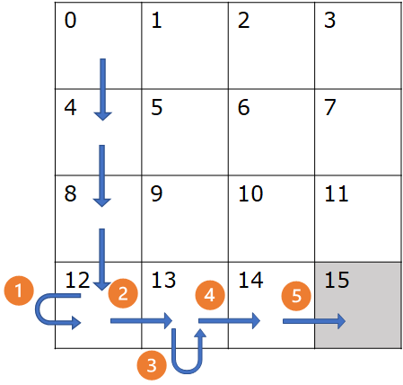
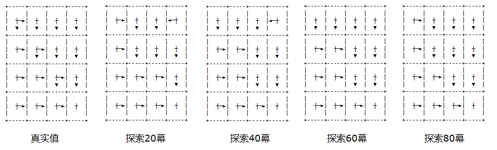

## 11.3 贪心法与探索性出发

### 11.3.1 贪心法（Greedy）

仍然用上一小节中的简单的方格世界举例，来理解**策略改进**是如何工作的。但是为了尽快收敛和增加复杂性，在 11.2 的方格世界中做了三个改动：
1. 每次移动的奖励为 0，出界时有 -1 的奖励，到达终点时奖励 1。这样可以减少出界的情况发生。
2. 每次移动有 0.8 的概率到达目标状态，各有 0.1 的概率偏向左右两个状态，如果出界则回到原地。
3. 设置折扣为 $\gamma$ = 0.9，这样如果在界内多绕路的话，会得到较小的奖励，鼓励智能体走最短路径。

根据图 11.2.5，算法可以这样写：

【算法 11.3.1】

---

输入：起始状态 $s$，策略 $\pi$，折扣 $\gamma$, 幕数 Episodes
初始化数组：$V(S,A) \leftarrow 0, N(S,A) \leftarrow 0$，$S$ 为状态空间，$A$ 为动作空间
多幕 Episodes 循环：
　　列表置空 $Episode = [\ ] $ 用于存储序列数据 $(s,a,r)$
　　幕内循环直到终止状态：
　　　　$Episode \leftarrow$ 采样
　　$G_t \leftarrow 0$
　　对 $Episode$ 从后向前遍历, $t=\tau-1,\tau-2,...,0$
　　　　计算 $G_t$
　　　　$Q(s_t,A) \leftarrow V(s_t,A) / N(s_t,A)$
　　　　$\pi(s_t) \leftarrow \argmax_a Q(s_t,A)$ # 取出最大值对应的动作序号
输出：$Q(S,A)$

---


对比算法 10.5，前面的部分都是相同的，因为同样是计算 $Q$ 值。不同之处在于新增加了两行：

- 倒数第三行，$Q(s_t,A) \leftarrow V(s_t,A) / N(s_t,A)$，大写 $A$ 表示数组操作，同时计算某个状态下的所有动作的 $Q$ 值，便于后面对于该状态下的所有动作做比较；
- 倒数第二行，修改策略 $\pi$。

以下代码为初始化环境部分：

【代码位置】MC_113_GridWorld_ES.py

```python
    env = model.GridWorld(
        GridWidth, GridHeight, StartStates, EndStates,  # 关于状态的参数
        Actions, Policy, Transition,                    # 关于动作的参数
        StepReward, SpecialReward,                      # 关于奖励的参数
        SpecialMove, Blocks)                            # 关于移动的限制
    gamma = 0.9
    max_iteration = 500
```

可以看到初始的策略是随机的，每个动作的选择概率都是 0.25。折扣为 0.9。最大采样幕数为 500（当然可以再多些）。

其中，我们用概率值来表示策略。

下面的代码是策略改进：

```python
class MC_Greedy(base.Policy_Iteration):
    def policy_improvement(self, s):
        # 做策略改进，贪心算法
        self.Q[s] = self.Value[s] / self.Count[s]  # 得到该状态下所有动作的 q 值
        self.policy[s] = 0               # 先设置该状态所有策略为 0（后面再把有效的动作设置为非 0）
        argmax = np.argwhere(self.Q[s]==np.max(self.Q[s]))    # 取最大值所在的位置（可能不止一个）
        p = 1 / argmax.shape[0]                     # 概率平均分配给几个最大值
        for arg in argmax:                          # 每个最大值位置都设置为相同的概率
            self.policy[s][arg[0]] = p
```

其中，“概率平均分配”的意思是：
- 如果最大值只有一个，比如 [0.23, 0., 0., 0. ]，那么策略会是 [1, 0, 0, 0]；
- 如果最大值只有两个，比如 [0.54, 0., 0.54., 0. ]，那么策略会是 [0.5, 0, 0.5, 0]；
- 以此类推，同时有三个最大值时概率是 0.333，四个时概率是 0.25。

当我们信心满满地用代码实现了这个算法后，实际运行时，会发现一个问题：运行了几幕后，程序就停在某处不动了！通过审查算法可以知道，能造成死循环的只有分幕采样部分。Debug 后发现，有两种情况导致程序在幕内循环时，始终不能到达终止状态：

1. 在某个边角位置的状态。智能体出界后回到原地，下一步又出界，还是回到原地，始终不能离开这个状态；
2. 在某几个状态内来回移动，形成闭环。比如从 $s_4$ 向右移动到 $s_5$；在 $s_5$ 向左移动，又回到 $s_4$。

为什么会造成这种情况呢？

还是要看算法：在每一次分幕采样结束后，立刻就开始进行策略更新。因为是从后向前遍历，所以在某个状态中，即使采取了错误方向的动作，由于后续的动作是正确的，那么开始的错误动作也会被认为正确的动作。

<center>


图 11.3.1 
</center>


举例来说，在图 11.3.1 中，$s_{12}$ 状态时（我们暂时忽略从 $s_0$ 到 $s_{12}$ 的过程）：
1. 随机选择了动作 1 向左走，回到原地；
2. 随机选择了动作 2 向右走到 $s_{13}$；
3. 随机选择动作 3 向下走回到原地；
4. 随机选择动作 4 向右走到 $s_{14}$；
5. 随机选择动作 5 向右走到 $s_{15}$，分幕结束。

当然，由于随机性较强，真实的采样过程可能比上面的例子更复杂。

由于最终是到达了终点，所以前面的一系列动作都被认为是有效的，包括错误的动作 1 和动作 3。在倒序遍历时：
1. 看动作 5，能够确定状态 $s_{14}$ 时向右走；
2. 看动作 4，能够确定状态 $s_{13}$ 时向右走；
3. 看动作 3，认为状态 $s_{13}$ 时应该向下走，这就把动作 4 的策略给覆盖了；
4. 看动作 2，能够确定状态 $s_{12}$ 时向右走；
5. 看动作 1，认为状态 $s_{12}$ 时应该向左走，这就把动作 2 的策略给覆盖了。

所以，最终确定的策略是在状态 $s_{12}$ 时向左走！这样就永远不能跳出分幕循环。原因很简单，就是分幕采样的样本太少了，不能做出正确的判断。

### 11.3.2 探索性出发（Exploring Starts）

除了上面说的错误动作外，在图 11.3.1 中还展示了另外一个问题：右上方的 9 个状态（1,2,3,5,6,7,9,10,11）没有被遍历到，或者是被遍历的次数极少，不能正确体现出其实际的动作价值。在 8.4 节中，我们学习过 $Q$ 函数的定义。如果应用到简单的方格世界问题上，$Q$ 函数表格会如表 11.3.1 所示。

表 11.3.1 简单方格问题的 $Q$ 函数表格

|状态 $\downarrow$ 动作$\to$|左|下|右|上|
|:-:|:-:|:-:|:-:|:-:|
|0|$q_\pi(s_0,a_0)$|$q_\pi(s_0,a_1)$|$q_\pi(s_0,a_2)$|$q_\pi(s_0,a_3)$|
|1|$q_\pi(s_1,a_0)$|$q_\pi(s_1,a_1)$|$q_\pi(s_1,a_2)$|$q_\pi(s_1,a_3)$|
|...|...|...|...|...|
|14|$q_\pi(s_{14},a_0)$|$q_\pi(s_{14},a_1)$|$q_\pi(s_{14},a_2)$|$q_\pi(s_{14},a_3)$|
|15|$q_\pi(s_{15},a_0)$|$q_\pi(s_{15},a_1)$|$q_\pi(s_{15},a_2)$|$q_\pi(s_{15},a_3)$|

状态-动作的组合构成 $Q$ 表格，一共有 16x4=64 个组合。如果想评价在某个状态上哪个动作最好，那么最起码要在该状态上尝试完所有动作后才会有评价的基础。

但是还有一个问题，如果总是从 $s_0$ 出发的，状态 $s_5$ 有可能会被绕过去，永远没有机会被访问到，虽然概率很小，但不可避免。所以我们需要以 $s_5$ 为起点，和 $s_0$ 一样做很多次分幕采样。

我们把这种方法叫做探索性出发，它包括三个含义：
1. 从所有可能的状态出发；
2. 尝试所有可能的动作；
3. 多次采样。

首先改一下方格世界的起始状态定义：

```python
# 起点，可以多个
StartStates = list(range(15))
```

上述代码可以产生一个列表，从 0 到 14，不包括 15，因为它是终止状态。

然后在方格世界的基础代码中，修改 reset() 函数，让它随机从 0-14 中选择起始状态。

```python
    def reset(self):
        self.curr_state = np.random.choice(self.StartStates)
        return self.curr_state
```

关于策略，我们仍然在开始时使用随机策略，可以保证每个动作都被选择到。

```python
policy = helper.create_policy(env.nS, env.nA, (0.25, 0.25, 0.25, 0.25))
```

还需要指定一个我们期望的探索次数，即每个状态上的每个动作被选择的次数。

```python
exploration = 20
```

算法改进：

【算法 11.3.2】

---

输入：起始状态 $s$，策略 $\pi$，折扣 $\gamma$，幕数 Episodes，最小搜索次数 exploration
初始化数组：$V(S,A) \leftarrow 0, N(S,A) \leftarrow 0$，$S$ 为状态空间，$A$ 为动作空间
多幕 Episodes 循环：
　　随机选择所有状态和所有动作作为起始
　　列表置空 $Episode = [\ ] $ 用于存储序列数据 $(s,a,r)$
　　幕内循环直到终止状态：
　　　　$Episode \leftarrow$ 采样
　　$G_t \leftarrow 0$
　　对 $Episode$ 从后向前遍历, $t=\tau-1,\tau-2,...,0$
　　　　计算 $G_t$
　　　　$if \min_a N(s_t,A) > $ exploration，则开始执行优化：
　　　　　　$Q(s_t,A) \leftarrow G(s_t,A) / N(s_t,A)$
　　　　　　$\pi(s_t) \leftarrow \argmax_a Q(s_t,A)$ # 取出最大值对应的动作序号
输出：$Q(S,A)$

---

与算法 11.3.1 相比，有两点不同：
1. “随机选择所有状态和所有动作作为起始”是新增加的，用 env.reset() 来保证起始状态是随机的，用 policy=[0.25, 0.25, 0.25, 0.25] 来保证所有动作都被选择到。
2. $if \ \min_a N(s_t,A) > $ exploration，是新增加的，用来保证每个状态下的所有动作的被选择次数都大于探索次数 exploration，才开始进行策略改进。

算法实现如下：

```python
class MC_ES(base.Policy_Iteration):
    def __init__(self, env, init_policy, gamma, exploration):
        super().__init__(env, init_policy, gamma)
        self.exploration = exploration  # 设置探索次数

    def policy_improvement(self, s):
        if np.min(self.Count[s]) <= exploration:
            return        # 如果次数不够，则不做策略改进
        # 做策略改进，贪心算法
        self.Q[s] = self.Value[s] / self.Count[s]  # 得到该状态下所有动作的 q 值
        self.policy[s] = 0               # 先设置该状态所有策略为 0（后面再把有效的动作设置为非 0）
        argmax = np.argwhere(self.Q[s]==np.max(self.Q[s]))    # 取最大值所在的位置（可能不止一个）
        p = 1 / argmax.shape[0]                     # 概率平均分配给几个最大值
        for arg in argmax:                          # 每个最大值位置都设置为相同的概率
            self.policy[s][arg[0]] = p
```

主要是在做策略改进之前，先判断是不是探索次数足够多。有可能某些状态被访问了很多次，那么可以在这些状态上先做策略改进，而那些次数不够的状态，依然保持随机策略。

首先我们尝试 exploration = 10，即每个动作的最小访问次数为 10 次时，会造成分幕采样时的死循环，所以最终令 exploration = 20，可以避免这个问题。如果设置成更大的值，效果更佳，要针对具体情况来分析。

图 11.3.2 为不同的探索次数与最终的策略结果的对应关系。

<center>


图 11.3.2
</center>

- 真实值：
    在对角线上是可以向下和向右两个方向移动，在对角线右上方都是向下移动，在对角线左下方都是向右移动；
- 探索 20 幕：$s_3$ 有问题；
- 探索 40 幕：$s_3$ 有问题；
- 探索 60 幕：没有问题；
- 探索 80 幕：
    没有问题。由于是蒙特卡洛方法，所以不能要求非常精确地在对角线上是两个方向，只要看对角线上方和下方的箭头方向正确即可。

在探索 20 幕时，它不是最优策略，但是已经是可以到达终点的策略了，虽然在 $s_3$ 处还有问题。增加 max_iteration 的次数，并不会改善上面的问题，因为使用的是贪心策略，一旦定型，很难更改。此时需要增加 exploration 的数值，才能得到更好的策略。

在二十一点问题中，由于 GYM 环境的限制，我们无法指定初始状态，只能由环境随机分配，有可能是按正态分布或均匀分布，这会造成一些不确定性。但是在算法实现中的下面的这一行代码很“聪明”：

```python
        if np.min(self.Count[s]) <= exploration:
            return        # 如果次数不够，则不做策略改进
```

可以通过指定 exlploration 值来变向使用探索性出发的算法，比如，令其为 500，基本就可以满足二十一点的需求了。
