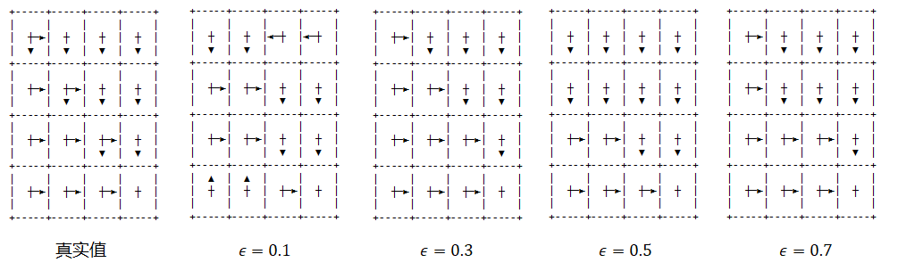
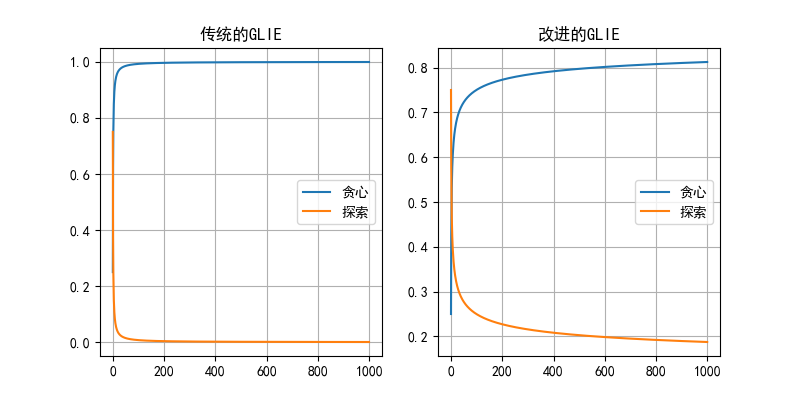
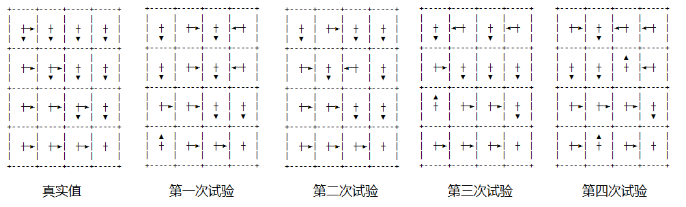
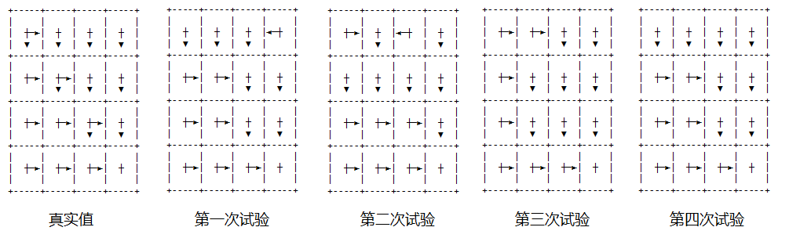

## 10.4 软性策略

### 10.4.1 $\varepsilon$-贪心策略

#### 持续保留探索的机会

在 11.3 节中，我们使用贪心算法配合探索性出发，来评估动作价值。因为探索性出发可以提供足够的机会让备选动作来表现出价值，然后才能贪心，这与第二章的多臂强盗问题是相同的。但是它的缺点是显而易见的：
1. 不知道要探索多少次才算合理；
2. 需要每个状态都可以作为起点。

在本章中，我们将学习软性策略，来避开探索性出发的缺点。比如在二十一点问题中，Gym 的交互环境不可能让我们指定每个状态作为起点，虽然它具有一定的随机性，但仍然不能满足均等的机会。

我们已经不是第一次接触软性策略了，在第二章的多臂强盗问题中，曾经学习过梯度上升法，里面使用了 Softmax 函数，根据各个动作的价值计算出备选概率，而不是使用非黑即白的硬性策略 argmax() 来选择后续动作。这样做的好处是：一方面在以最大概率选择（利用）了历史表现最好的动作的同时，给其它表现不好的动作一定的机会来进行探索。

具体到策略问题上来，与 4.4.2 节的 $\varepsilon$-贪心策略差不多，使用一个概率值来贪心地执行当前已知的最佳动作，而用另外一个概率值来进行探索。其策略表示为式（11.4.1）：

$$
\pi'(a \mid s)=
\begin{cases}
1-\varepsilon+\frac{\varepsilon}{|A|}, & a=\argmax_a Q(s,a)
\\
\frac{\epsilon}{|A|}, & a \ne \argmax_a Q(s,a)
\end{cases}
\tag{11.4.1}
$$

用 $\pi'$ 表示更新策略，在实际的操作中是在原策略 $\pi$ 上直接更新，初始原策略可以是随机策略。

假设 $\varepsilon=0.4,|A|=4$，则：
- 当 $a$ 是四个动作的最大值时，$\pi(a|s)=1-0.4+0.4/4=0.7$
- 当 $a$ 不是四个动作的最大值时，$\pi(a|s)=0.4/4=0.1$

其中，最大值动作独占 0.7，其它三个动作分享剩下的 0.3。很容易看到，$0.7+0.1 \times 3=1.0$ 是一个全概率值，则后续的策略是在那个目前最佳的动作上，以 0.7 的概率继续贪婪执行，以 0.1 的概率选择执行其它三个动作，这样就可以**持续保留探索的机会**。

#### 算法及实现

【算法 11.3.2】

---

输入：起始状态 $s$，策略 $\pi$，折扣 $\gamma$，幕数 Episodes，贪心系数 $\varepsilon$
初始化数组：$G(S,A) \leftarrow 0, N(S,A) \leftarrow 0$，$S$ 为状态空间，$A$ 为动作空间
多幕 Episodes 循环：
　　列表置空 $Episode = [\ ] $ 用于存储序列数据 $(s,a,r)$
　　幕内循环直到终止状态：
　　　　从 $s$ 根据策略 $\pi$ 得到动作 $a$
　　　　执行 $a$ 从环境得到 $s',r$ 以及是否终止的标志
　　　　$Episode \Leftarrow (s,a,r)$，相当于是 $(s_t,a_t,r_{t+1})$
　　　　$s \leftarrow s'$
　　$G_t \leftarrow 0$
　　对 $Episode$ 从后向前遍历, $t=\tau-1,\tau-2,...,0$
　　　　取出 $(s_t,a_t,r_{t+1})$
　　　　$G_t \leftarrow \gamma G_t+r_{t+1}$
　　　　$G(s_t,a_t) \leftarrow G(s_t,a_t)+G_t$
　　　　$N(s_t,a_t) \leftarrow N(s_t,a_t)+1$
　　　　$Q(s_t,A) \leftarrow G(s_t,A)/N(s_t,A)$
　　　　$A^* \leftarrow \argmax_a Q(s_t,A)$
　　　　$\pi(a \mid s)=
\begin{cases}
1-\varepsilon+\frac{\varepsilon}{|A|}, & a=A^*
\\
\frac{\varepsilon}{|A|}, & a\ne A^*
\end{cases}
$
输出：$Q(S,A)$

---

算法实现如下：

```python
class MC_SoftGreedy(base.Policy_Iteration):
    def __init__(self, env, init_policy, gamma, epsilon):
        super().__init__(env, init_policy, gamma)
        self.epsilon = epsilon
        self.best_p = 1 - epsilon + epsilon / self.nA   # 最佳动作备选概率 
        self.other_p = epsilon / self.nA    # 其它动作备选概率        

    def policy_improvement(self, s):
        # 做策略改进，soft-greedy 算法
        if np.min(self.Count[s]) == 0:  # 避免被除数为 0
            return
        self.Q[s] = self.Value[s] / self.Count[s]  # 得到该状态下所有动作的 q 值
        self.policy[s] = self.other_p    # 先设置该状态所有策略为普通动作策略
        argmax = np.argmax(self.Q[s])
        self.policy[s, argmax] = self.best_p    # 设置最佳动作策略
```

选择 $\varepsilon=[0.1, 0.3, 0.5, 0.7]$ 做试验，最大采样次数为 episodes = 1000，得到图 11.3.2 所示结果：

<center>


图 11.3.2
</center>

请读者注意，$\varepsilon$ 的值如果越大对探索越有利，越小越偏向贪心利用。

$\varepsilon=0.1$ 时，

$$
\pi(a \mid s)=
\begin{cases}
0.925, & a 是最佳动作，贪心利用的概率
\\
0.025, & a 不是最佳动作，探索的概率
\end{cases}
\tag{11.4.2}
$$

在图 11.3.2 第二张子图中，右上角的两个状态和左下角的两个状态实际上是不对的，这说明探索的概率不够。

$\varepsilon=0.7$ 时，

$$
\pi(a \mid s)=
\begin{cases}
0.475, & a 是最佳动作，贪心利用的概率
\\
0.175, & a 不是最佳动作，探索的概率
\end{cases}
\tag{11.4.3}
$$

在图 11.3.2 第五张子图中，所有状态上的策略都很完美。

当 $\varepsilon=0.3,0.5$ 时，第三张子图所示的策略非常不错，第四张子图反而不是很完美，$s_4$ 应该向右而不是向下，这与随机过程有关，与算法无关。

从式（11.4.2）和（11.4.3）中，可以看到贪心利用的概率值的差异，一个是 0.925，一个是 0.475。本次试验的结果是 $\varepsilon$ 的值越大效果越好，越可以找到最终的最佳策略。但是一旦找到了最佳策略，仍然以 $0.175 \times 3=0.525$ 的概率去探索，而不是最大化地利用，这里并没有给出完美解决方案。

#### 符合策略改进定理的证明

$\varepsilon$-贪心策略为什么可以做到策略改进呢？假设 $\pi$ 是上一轮的策略，$\pi'$ 是改进后的策略，则对任意的状态 $s$ 有：

$$
\begin{aligned}
v_{\pi'}(s)&=\sum_a \pi'(a|s)q_{\pi'}(s,a)    &(1)
\\
&=\sum_a \pi'(a|s)q_\pi(s,a)  &(2)
\\
&=\frac{\varepsilon}{|A(s)|} \sum_a q_\pi(s,a) + (1-\varepsilon) \max_a q_\pi(s,a) &(3)
\end{aligned}
\tag{11.4.4}
$$

式（11.4.4）中：
- 子式（1）根据式（8.4.3）得到。
- 子式（2），由于$\pi$ 是 $\pi'$ 的上一轮策略，$\pi'$ 目前还没有执行，所以 $q_{\pi'}(s,a)=q_{\pi}(s,a)$，仍然使用策略 $\pi$ 下的 $q$ 值来估算 $v_{\pi'}$。
- 子式（3）是把子式（2）拆开。假设 $|A(s)|=4, q_\pi(s)=[1,2,3,4]$，对应 4 个动作的价值。设 $\varepsilon=0.4$，则 $\pi'=[0.1,0.1,0.1,0.7]$，选第 4 个动作的概率最大。 那么：
    - $\sum \pi'(a|s)q_\pi(s,a)=3.4$
    - $\frac{\varepsilon}{|A(s)|} \sum q_\pi(s,a) + (1-\varepsilon) \max_a q_\pi(s,a)=\frac{0.4}{4} \cdot 10 + (1-0.4)\cdot 4=3.4$
    
    二者是相等的。

接下来把 $\max_a q_\pi(s,a)$ 部分替换成加权求和的形式。

因为：

$$
\sum_a \frac{\pi(a|s)-\frac{\varepsilon}{|A(s)|}}{1-\varepsilon}=\frac{1}{1-\varepsilon}\big (\sum_a \pi(a|s) - \varepsilon \sum_a \frac{1}{|A(s)|}\big)=\frac{1}{1-\varepsilon}(1-\varepsilon)=1
$$

所以可以把 $\sum_a \frac{\pi(a|s)-\frac{\varepsilon}{|A(s)|}}{1-\varepsilon}$ 当作是权值（至于为什么是这种形式，答案就是为了在后面的推导中去掉 $\frac{\varepsilon}{|A(s)|} \sum q_\pi(s,a)$ 项），对 $q_\pi(s,a)$ 的加权求和，而加权求和的值一定小于 $q_\pi$ 中的最大值，所以有：

$$
\max_a q_\pi(s,a) > \sum_a \frac{\pi(a|s)-\frac{\varepsilon}{|A(s)|}}{1-\varepsilon} q_\pi(s,a)
$$

续式（11.4.4）:

$$
\begin{aligned}
v_{\pi'}(s)&=\sum_a \pi'(a|s)q_\pi(s,a)
\\
&=\frac{\varepsilon}{|A(s)|} \sum_a q_\pi(s,a) + (1-\varepsilon) \max_a q_\pi(s,a)
\\
&\ge \frac{\varepsilon}{|A(s)|} \sum_a q_\pi(s,a) + (1-\varepsilon) \sum_a \frac{\pi(a|s)-\frac{\varepsilon}{|A(s)|}}{1-\varepsilon} q_\pi(s,a)
\\
&= \frac{\varepsilon}{|A(s)|} \sum_a q_\pi(s,a) - \frac{\varepsilon}{|A(s)|} \sum_a q_\pi(s,a) + \sum_a \pi(a|s)q_\pi(s,a)
\\
&=\sum_a \pi(a|s)q_\pi(s,a)
\\
&=v_\pi(s)
\end{aligned}
\tag{11.4.4}
$$

所以结论是 $v_{\pi'} \ge v_\pi$，即符合策略改进定理。该策略改进方法，当改进后的策略与原策略相同时，等号成立。

所以，我们现在把动态规划中的固定策略推广到了随机策略上。知道了如何让策略迭代适用于 -软性策略上。将贪心策略的原生概念扩展到了-软性策略上，在迭代时每一步都能保证策略有改进。注意：这里的分析假设了动作价值函数可以被精确的计算，但是在策略改进的时候，我们并不在意动作价值函数是如何被计算的。因此，我们目前可以获得 -软性策略集合中的最优策略了，不再需要试探性出发假设。


### 11.4.2 GLIE 方法

#### 传统的 GLIE 方法

在上面的 $\varepsilon$-贪心策略中，给定一个 $\varepsilon$ 后，在整个过程中始终使用这个值来分配探索与利用的概率分配，在开始阶段，如果有错误的话，并且如果探索概率较小的话，在后期很难纠正。那么是不是可以这样做：
1. 在开始阶段使用比较大的概率来探索，以保证覆盖范围；
2. 在后期基本确定方向后，用较大的概率来利用。

这就是 GLIE 方法可以解决的问题。

GLIE（Greedy in the Limit with Infinite Exploration），有限贪心与无限探索，这让笔者想起了吾辈之楷模雷锋叔叔的一句话：把有限的生命投入到无限的为人民服务之中。转义成一个人在把个人生活搞好的前提下，可以拿出更多的时间来帮助他人或者创造更多的社会价值，这个世界会变得更美好。

具体这样实现：假设一共采样 1000 次的话，$k$ 为当前的采样次数，取值从 1 到 1000。然后取 $\varepsilon=1/k$，观察两个极限状态：

- $k=1$ 时，$\varepsilon=1$，贪心的概率为 $1-\varepsilon+\varepsilon/4=0.25$，探索的总概率为 $0.75$；

- $k=1000$ 时，$\varepsilon=0.001$，贪心的概率为 $1-\varepsilon+\varepsilon/4=0.99925$，探索的总概率为 $0.00075$。

从图 11.4.2 左图可以看到，蓝色的贪心概率在 1000 次采样中形成一条变化的曲线，橙色的探索概率也形成一条曲线，二者在任一横坐标上相加为 1。但是两条曲线都过于陡峭了，也就是说只探索了不到 75 次，贪心的概率已经大于 0.99 了。

<center>


图 11.4.2
（左图：传统的GLIE；右图：改进的GLIE）
</center>


算法流程与算法 11.3.2 基本一致，只是修改策略 $\pi$ 的方法不一样。实现如下：

【代码位置】MC_11_GLIE_Standard.py

```python
class MC_GLIE_Standard(base.Policy_Iteration):
    def policy_improvement(self, s):
        if np.min(self.Count[s]) == 0:  # 避免被除数为 0
            return        
        epsilon = 1 / self.n_episode
        other_p = epsilon / self.nA
        best_p = 1 - epsilon + epsilon/self.nA
        self.Q[s] = self.Value[s] / self.Count[s]  # 得到该状态下所有动作的 q 值
        self.policy[s] = other_p         # 先设置该状态所有策略为 epsilong/nA
        argmax = np.argmax(self.Q[s])
        self.policy[s, argmax] = best_p
        return self.policy
```

那么这种方法的探索和利用的比例是否合适呢？我们仍然用简单的方格世界来做试验，一共做四次独立的试验，每次都是采样 2000 幕，得到结果如图 11.4.3 所示。

<center>


图 11.4.3 传统的 GLIE 方法的结果
</center>

每次试验都有些状态上的策略不令人满意，比如：
- 第一次试验中的 $s_{12}$；
- 第二次中的 $s_6$；
- 第三次中的 $s_1,s_3,s_8$；
- 第四次中的 $s_2,s_3,s_6,s_{13}$。

#### 改进的 GLIE 算法

这说明在这个例子中探索的次数不够，所以我们需要调整图 11.4.2 左图中的曲线的形状，让它们更平缓一些。最简单的办法就是先取 $k$ 的对数，再求倒数，即令 $\varepsilon=\frac{1}{\lg(k)+1}$，则陡峭的曲线将会变得平缓，如图 11.4.2 右图所示。分母加 1 的原因是避免被除数为 0。当 $k=1000$ 时，$\varepsilon=0.25$，贪心的概率为 $1-\varepsilon+\varepsilon/4=0.8125$，探索的总概率为 $0.1875$。

算法流程与算法 11.3.2 基本一致，只是修改策略 $\pi$ 的方法不一样。实现如下：

【代码位置】MC_11_GLIE_Improved.py

```python
class MC_GLIE_Improved(base.Policy_Iteration):
    def policy_improvement(self, s):
        if np.min(self.Count[s]) == 0:  # 避免被除数为 0
            return        
        epsilon = 1 / (math.log(self.n_episode, 10)+1)
        other_p = epsilon / self.nA
        best_p = 1 - epsilon + epsilon/self.nA
        self.Q[s] = self.Value[s] / self.Count[s]  # 得到该状态下所有动作的 q 值
        self.policy[s] = other_p         # 先设置该状态所有策略为 epsilong/nA
        argmax = np.argmax(self.Q[s])
        self.policy[s, argmax] = best_p
        return
```
注意要取以 10 为底的对数，否则就是取自然对数了，那么改进效率要低很多。

这种简单的改进带来的效果是明显的，仍然做 4 次独立试验，采样 2000 次，得到结果如图 11.4.4。

<center>


图 11.4.4 改进的 GLIE 方法的结果
</center>

有些错误的策略如：

- 第一次试验中的 $s_3$；
- 第二次试验中的 $s_2$；

但总体上比传统的 GLIE 方法要好很多。
