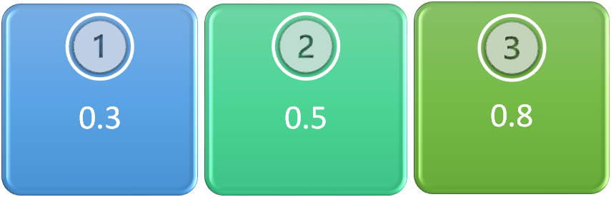
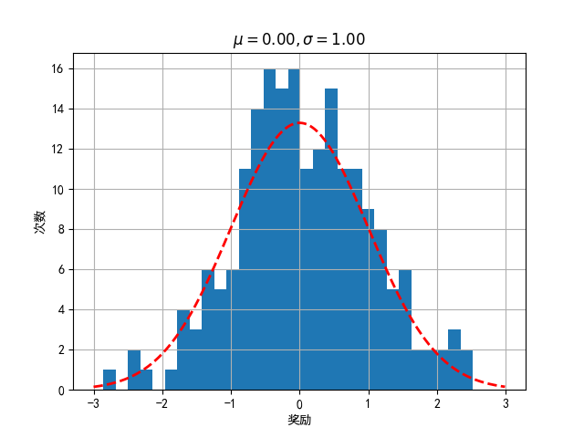
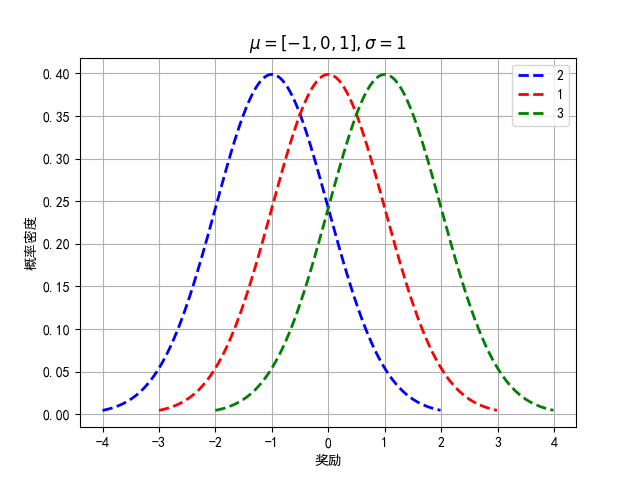
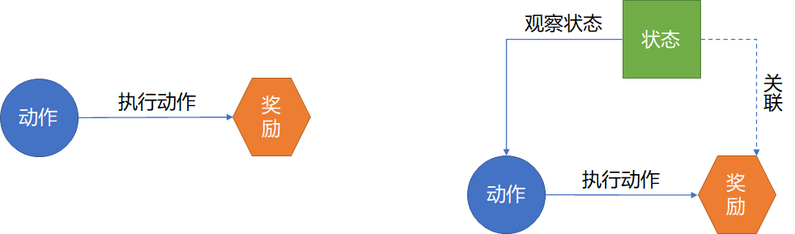

## 2.1 赌博机研究平台

### 2.1.1 原始的赌博机

注意，赌博在中国是违法行为！在本章中的“赌博机”并非真正地研究赌博问题，而是把它抽象成为数学问题和强化学习问题，得到结论后用来解决类似的问题。把数学变成赌博工具是人类的发明，正如同科学可以救人也可以杀人一样。

赌博机，即“老虎机”，英语为 Slot Machine，或者 one-arm bandit（单臂强盗）。

- 为什么叫老虎机？

    - 因为最初的设计中，内部有三个大卷轴，印有很多图案；
    - 赌徒投入一个投硬币，搬动摇杆，卷轴开始各自转动；
    - 最终停止转动时，如果三个卷轴上面显示的都是老虎图案，赌徒会获取丰厚的奖励。
    
- 为什么叫单臂/多臂强盗？ 

    - 因为这种机器回报率低，但是容易上瘾，让玩家输个精光，所以叫一条胳膊的强盗。很多现代的老虎机仍然保持一个传统的机械操作摇臂，可与电子按钮并行使用。

    - 有的赌徒有策略地操作多台老虎机，以实现最高的获利，这样的赌徒就称作“多臂强盗”（K-Armed Bandits）。

    - 某些翻译软件把 K-Armed Bandits 翻译成“武装匪徒”，因为 Armed 有“武装”的意思，读者自行理解吧。

### 2.1.2 如何在老虎机上赢钱

这是一个国外友人总结的如何在赌场中的老虎机上赢钱的几条经验。请读者一起阅读一下，以便对我们后续的算法研究提供思路。

1. Choose Slot Machines with High Price per Spin

    选择每次赌注高的老虎机。

    虽然这一提示似乎违反直觉，但下注的赌注越高的老虎机回报的频率越高，金额越大。这就是老虎机的设计方式，吐币的百分比与赌注大小成正比。此外，最大赌注可以帮助您解锁特殊功能，如免费增加一次摇臂机会或中头奖机会。

2. Choose the Least Complicated Slot Machines

    选择最简单的老虎机。

    在赌场使用这条普遍的经验法则：如果游戏复杂，它的回报就会少。在复杂的老虎机游戏中，赌场试图通过特殊的乘数、奖金或额外的摇臂次数来吸引你的注意力。虽然你可能喜欢这些特殊功能，但它们只会使游戏复杂化，并降低获胜的几率。

3. Test the Machines Before you Play

    在玩大赌注之前测试机器。

    大多数赌场在其许多老虎机上提供免费试用，这意味着你可以先测试五到十圈，让你更容易制定出一个行动计划，以便在使用真金白银的时候采取正确的策略。

4. Use Cash Instead of Card

    以现金代替信用卡。

    赌场可以欺骗客户的一个窍门是，他们可以兑换零钱，这就是为什么赌场使用筹码而不是现金，玩家的借记卡/信用卡就像筹码一样。如果使用卡，玩家可能会忘记自己花了多少钱。只带一定数量的现金到赌场，购买一定数量的筹码，一旦损失殆尽后就离开。

5. Know When to Leave the Casino

    知道什么时候离开赌场。

    赌场里的老虎机注定会让人上瘾。赢钱时，你可能会想赢更多的钱；输钱时，你可能会想着把输的钱都赚回来。就和股票一样，如果没有止盈和止损目标，最后的结果差不多都是输光。

我们可以从中得到的指导思想是：

1. 先探索（exploration），看看哪个摇臂带来的回报最高。
2. 后利用（exploitation），确定好第一条后，就可以“贪婪地”获得回报。
3. 设置一个限制值来比较各自算法的优略，比如，比较 100 轮内哪个算法表现最好；扩大到 200 轮内又会有何变化？
4. 不同的应用场景使用不同的算法。
5. 设置合理的奖励值，便于比较算法性能。

### 2.1.3 多臂赌博机研究平台

因为单臂的赌博机应用场景比较简单，所以在算法研究领域都是多臂赌博机平台，有以下几类：

- 固定收益的多臂赌博机
- 随机分布收益的多臂赌博机
- 上下文赌博机
- 其它

注意，多臂赌博机不是单臂赌博机的简单集合，而是在内部有一定的关系。比如：两个单臂赌博机的得奖概率都是 0.2，那么一个双臂赌博机的两个拉杆臂，有可能其中一个设置为 0.1 的得奖概率，另外一个设置为 0.3。

下面我们来一一介绍。

#### 固定收益的多臂赌博机

如图 2.1.1 所示，假设是一个三臂赌博机，玩家投一次币（假设是一元钱），选择一个序号，拉动一次摇臂（或者按一次按钮）。

图 2.1.1 固定收益的多臂赌博机

假设玩家选择 1 号，则该臂机会以 $p_1=0.3$ 的概率回吐一元钱做为奖励，即 10 次中可能有 3 次回吐一元钱，其它 7 次没有奖励。另外两臂的回吐概率是 $p_2=0.5,p_3=0.8$，但是玩家在开始时**并不知道**这个信息，需要摸索。

这个应用场景相对简单，可以总结为：

- 收益固定为离散值 0/1，即伯努利分布。
- 回吐概率可以灵活设置。
- 算法简单，运行速度快，见效快。
- 初学者容易理解。
- 有预设的上限可以参考：比如以图 2.1.1 的设置为例，玩 1000 次的最大收益应该是 800 元。
- 衡量指标有限，不能体现复杂算法的优势。
- 能体现客观世界（赌场）的真实情况，但是对算法研究没有帮助，所以不能应用于其它场景。

这种场景下，先玩 10 次，基本上就能知道 3 号臂是收益最高的，以后总拉动 3 号臂即可。

#### 分布收益的多臂赌博机

第二类研究平台如图 2.1.2 所示，每个臂的回报有正有负，而且不固定，也不是整数，而是有一个正态分布的。

图 2.1.2 收益按概率分布的多臂赌博机

依然假设只有三臂，每个拉杆臂的收益都是一个正态分布，方差为 1，均值有可能分别是 0,-1,+1。

举例来说，假设用户选择 1 号臂，进行 200 轮游戏的话，会看到如图 2.1.3 的奖励分布。

【代码位置】bandit_21_Armit.py

图 2.1.3 收益按概率分布的多臂赌博机的 1 号臂

1 号臂的情况是一个正态分布：

- 奖励（即收益）不是正整数，而是浮点数，有正有负；
- 奖励在 0 附近的次数最多，占据了 70% 左右；
- 最大值，有机会得到 +2 的奖励或更大，但次数极少；
- 最小值，有机会得到 -2 的奖励或更小，但次数极少。

2 号和 3 号臂就是 1 号臂的分布情况分别向左或右移动一个单位的正态分布。

玩家事先肯定不知道图 2.1.4 所示的概率分布，现在我们假设：

- 玩家第一次玩，选择了 2 号臂（蓝色虚线），得到了 2 的奖励；
- 第二次选择了 1 号臂（红色虚线），得到了 1 的奖励；
- 第三次选择了 3 号臂（绿色虚线），得到了 0 的奖励；

那么该玩家如何选择后面几轮的玩法？

【代码位置】bandit_21_Armit.py

图 2.1.4 收益按概率分布的多臂赌博机的 1 号臂

我们从上帝视角看，显然 3 号臂是最好的，但是在前三轮，很不巧，玩家遇到了相反的情况。如果玩家就此认定 2 号臂最好，那么最后将会输的很惨。所以，如何尽快地确定哪个臂最好，就是这一类多臂赌博机要解决的问题。

**在本章中，这类赌博机是我们研究的目标。**

#### 上下文赌博机（Contextual Bandits）

在上面介绍的普通多臂赌博机中，玩家面对的是一个“面部毫无感情而且内心似铁的冷冰冰的家伙”，也就是说：

1. 内置的的奖励机制预先设置不会变化；
2. 没有任何外在的特征可以供玩家识别。

上下文赌博机（Contextual Bandits）也是多臂赌博机的一种，但是，上下文赌博机提供了一种外在的状态，比如：赌博机上有一个灯，平时不亮，当它亮起时，表示赌博机内部运行了不一样的奖励机制，鼓励玩家多下注赢大奖，或者是选择一个特殊的拉杆臂。

图 2.1.5 从概念上展示了上下文（多臂）赌博机与多臂赌博机的不同。

图 2.1.5 普通多臂赌博机与上下文赌博机
（左图：普通多臂赌博机；右图：上下文赌博机）

可以理解为上下文赌博机有“表情”了，即图 2.1.5 中的“状态”，玩家可以通过观察外在状态来决定选择哪个臂，因为状态也和奖励有关联，相当于是给了玩家一个线索。但是，玩家的动作并不会改变赌博机的状态，状态完全由赌博机内部决定并展示出来，不受外界影响。

#### 其它变种

多臂赌博机研究平台的其它一些变种有：

- Adversarial bandit，对抗式赌博机，赌博机会有一些智能设计来针对你的习惯做一下改变，让玩家不能沿用以前的经验继续获利。
- Infinite-armed bandit，无限臂赌博机，玩家可以选择一个非离散值的臂，比如 1.5,2.1 等等，类似于在一个连续函数上随机任意选择一个自变量。
- Lipschitz bandit，利普希茨赌博机，就是具有利普希茨奖励属性的赌博机平台。
- Non-stationary bandit，非平稳状态的赌博机，奖励并不会按照预先设计的分布来执行，而是在一定范围内有一些波动。
- Dueling bandit，决斗式赌博机，玩家一次可以拉动两个臂，得到的信息是哪一个臂获得的奖励更多。
- Collaborative bandit，协作式赌博机，是上下文赌博机的一种，相关文献介绍的不多。
- Combinatorial bandit，组合式赌博机，每次玩家必须拉动几个拉杆臂，而不是单独的一个臂。

上述这些变种的多臂赌博机，与强化学习的关系已经不是很大了，所以我们在本书中不会去研究它们的细节。

**即使学习玩了本章的内容，也不要去赌博，因为赌场都是骗人的。**
