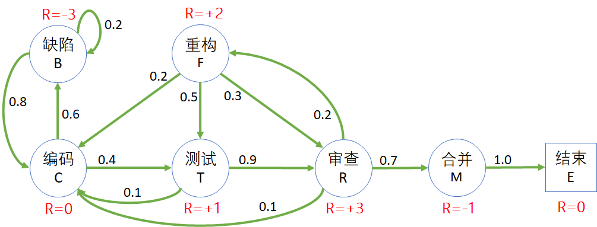

## 7.1 开发流程问题

### 7.1.1 提出问题

在解决安全驾驶问题的过程中，我们学习了马尔可夫奖励过程、状态价值函数等强化学习的重要概念。其中，计算价值函数需要大量的采样然后求平均值，才能得到**比较理想的结果**，并不能说是**准确的结果**，因为我们无法衡量什么叫做准确。

那么有没有更好的方法呢？

在本节中，我们以软件开发流程（代码的生命周期）问题为例，通过描述开发过程（编码、测试、审查、合并等）的状态/过程，来寻找用于分析解决有模型问题的**更好的办法**，而不是一味地使用采样方法依靠大数定律来计算状态价值函数。

图 7.1.1 开发流程问题模型

各个软件公司可能都有自己习惯使用的开发流程，传统的、现代的、瀑布式的、敏捷型的等等，但是关于代码生命周期部分都大致相同：

1. 开发人员根据需求写代码（编码）；
2. 单元测试，发现 Bug 及时修改；
3. 开一个新的 Branch，提交代码到代码仓库，提交成功后，具有 CI/CD pipeline 的系统会进行自动测试；
4. 测试不通过的话，要回到编码状态修改问题；通过的话会进入人工审查（review）阶段；
5. 审查发现小问题，要修改编码；发现大问题，要重构；没有问题的话，可以把代码合并到 main branch；
6. 重构其实也是一种编码，侧重于结构上的调整，而不是侧重于编写新的功能模块。如果需要添加功能，则回到编码状态；如果结构调整完毕，直接进入测试，或者再次进入审查阶段；
7. 代码合并到主分支后，结束代码生命周期。

下面我们会给以上过程进行建模，最终目标是求解各个状态的价值函数。

### 7.1.2 建立模型

根据上个小节中描述的开发流程中的代码生命周期问题，笔者建立的模型如图 7.1.2 所示。

- 圆形为状态，内含状态名称和缩写；
- 方形为终止状态；
- 绿色箭头为状态转移方向；
- 黑色数字为状态转移概率；
- 红色字体为状态奖励值。

奖励值的设计方案有很多，在此我们采用了面向代码质量的指导思想给各个状态定义不同的值：即，对代码质量有损害的为负值，反之为正值。

图 7.1.2 开发流程问题模型

图 7.1.2 中的状态、奖励、转移的说明见表 7.1.1。

表 7.1.1 状态的说明以及奖励函数的定义

|状态及代码|状态描述|状态奖励|状态转移概率|
|-|-|-|-|
|C：编码 Coding|开发人员写代码， 全神贯注，废寝忘食|在此状态下尚无法确定代码 质量，所以 $R=0$|0.6：产生 bug，需要修复 0.4：进入测试状态|
|B：缺陷 Bug|在单元测试过程中发现 Bug|如果不妥善解决会对代码质量 有很大影响，所以 $R=-3$|0.2：越改越糟糕 0.8：很快就改好了|
|T：测试 Testing| CI pipeline测试。提交 PR 后自动执行，通过后方可 进入下一阶段|严格把关，所以 $R=+1$|0.9：进入代码审查状态 0.1：测试不通过，修改编码|
|R：审查 Review| 由小组中其他人做代码审查|可以帮助提高代码质量， 所以 $R=+3$|0.7：通过了审查，可以合并代码 0.2：决定重构代码 0.1：修改少量代码|
|F：重构 reFactor|在审查过程中发现代码设计上 的一些缺陷，所以需要在现有 的基础上重构代码|对将来的可维护性、可扩展性 等等有很大帮助，所以 $R=+2$|0.2：需要补充新代码 0.5：进入测试状态 0.3：进入代码审查状态|
|M：合并 Merge|代码合并到 main branch， 然后结束|合并的过程实际上是有风险的， 它有可能给集成测试带来新的 问题，所以 $R=-1$。|1.0：进入结束状态|
|E：结束 End|结束本次代码的生命周期， 叫做结束状态或者吸收状态|吸收状态总是把奖励值 设置为 $R=0$|不再进行转移（或者以 1.0 的概率转移到自身）|

表 7.1.2 中列出了状态转移矩阵，与租车还车问题中的矩阵形式相同。

表 7.1.2 开发流程问题的状态转移矩阵

|P: 从$\rightarrow$到|缺陷|编码|测试|审查|重构|合并|结束|
|:-:|:-:|:-:|:-:|:-:|:-:|:-:|:-:|
|**缺陷**|0.2|0.8|-|-|-|-|-|
|**编码**|0.6|-|0.4|-|-|-|-|
|**测试**|-|0.1|-|0.9|-|-|-|
|**审查**|-|0.1|-|-|0.2|0.7|-|
|**重构**|-|0.2|0.5|0.3|-|-|-|
|**合并**|-|-|-|-|-|-|1.0|
|**结束**|-|-|-|-|-|-|1.0|

有的读者可能有个疑问：在修复代码缺陷的状态，刚开始时有可能是越改越遭，有 0.2 的概率转回到自身，但是后来应该会大概率向好的方向转移，不应该只有 0.8 的概率，基本上应该是 1.0 的概率改好。

这是一个简单的平稳环境的马尔科夫过程，如果考虑更复杂的情况，可以在该状态下增加一个计数器：
- 如果在缺陷状态超过 1 天，则有 0.9 或 1.0 的概率回到正常编码状态；
- 如果没超过 1 天，则有 0.2 的概率回到自身。

所以，模型这个东西，可以复杂，也可以简单，关键看建模时是否能够抓住重点，让智能体学到一个大致的正确方向，然后再逐步细化。

需要再次说明的是，在图 7.1.2 中，我们使用了**状态奖励**定义方式，直接给每个状态赋值一个奖励，意味只要达到这个状态，就可以立刻获得标注出的奖励值，而不管是从哪条路径达到的，或者下游状态是什么。

