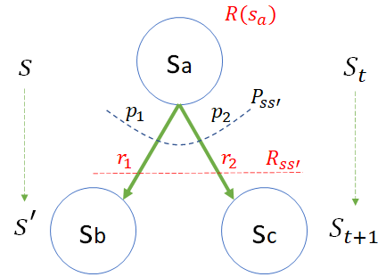
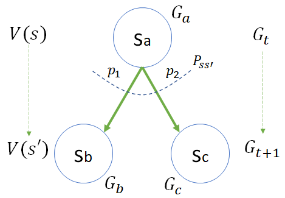

## 7.3 贝尔曼方程 Bellman Equation

### 7.3.1 对状态价值函数的进一步分解

前面已经学习了状态价值函数的定义，其公式为：

$$
v(s) = \mathbb E \big [G_t | S_t = s]
\tag{7.3.1}
$$

由于

$$
\begin{aligned}
G_t &= R_{t+1}+\gamma R_{t+2}+ \gamma^2 R_{t+3} + \gamma^3 R_{t+4} + \cdots &(1)
\\
G_{t+1} &= R_{t+2}+ \gamma R_{t+3}+ \gamma^2 R_{t+4} + \cdots &(2)
\end{aligned}
\tag{7.3.2}
$$

结合上述两式，可以做进一步的分解和推导：

$$
\begin{aligned}
v(s)&=\mathbb E \big [G_t|S_t=s\big ]
\\
(G_t分解\to)&=\mathbb E \big [R_{t+1}+\gamma R_{t+2}+\gamma^2 R_{t+3}+ \gamma^3 R_{t+4}+\cdots|S_t=s \big ]
\\
&=\mathbb E \big [R_{t+1}+\gamma (R_{t+2}+\gamma R_{t+3}+ \gamma^2 R_{t+4}+\cdots)|S_t=s\big ]
\\
(代入式7.3.2.2\to)&=\mathbb E \big [(R_{t+1}+\gamma G_{t+1})|S_t=s\big ]
\\
&= \underbrace{ \mathbb E \big [R_{t+1}|S_t=s\big ]}_A + \gamma \underbrace{\mathbb E \big [G_{t+1}|S_t=s \big ]}_B
\end{aligned}
\tag{7.3.3}
$$

到了这一步，把 $V(s)$ 分成了 $A,B$ 两部分，**$A$ 可以看作是即时奖励的数学期望，$B$ 可以看作是带折扣的未来回报的数学期望**。其中折扣 $\gamma$ 是个常数，不包含在 B 部分中。

下面分析一下这两部分如何分别得到。

### 7.3.2 A 部分：关于 $R_{t+1}$ 的数学期望

图 7.3.1 关于 $R_{t+1}$ 的数学期望

#### 目标

这一部分的目标是要得到 $R_{t+1}$ 的数学期望的具体表达式：$\mathbb E \big [R_{t+1}|S_t=s\big ]$。

在图 7.3.1 中，给出了上游状态 $s_a$，下游状态 $s_b,s_c$，以及状态转移过程中的概率 $p$ 和过程奖励 $r$。需要计算 $R(s_a)$。因为在 5.2 节中，其实已经给出了 $R_{t+1}$ 的定义：

$$
R(s)=\mathbb E[R_{t+1}|S_t=s] \tag{由式5.2.3}
$$

这里的 $R(s)$ 即图 7.3.1 中的 $R(s_a)$，也就是 $R_{t+1}$ 的数学期望。

#### 状态集定义

大写的 $S_t,S_{t+1}$，表示当前状态 $t$ 和下一个状态 $t+1$ 的**状态变量**，在不同的马尔可夫过程中会有不同的实例，所以只是一种通用表达方式，并不知道具体是哪个状态。

小写的 $s,s'$，表示具体的**状态实例**，具体到图 7.3.1 中：

$$
s = [s_a], \quad s' = [s_b,s_c] \tag{7.3.4}
$$

#### 转移概率定义

$P_{ss'}$ 是状态转移概率的集合，即转移矩阵。在图 7.3.1 中从 $s_a$ 出发有两个转移方向，分别是 $s_b,s_c$，对应的概率是 $p_1,p_2$，并且 $p_1+p_2=1$。

$$
P_{ss'}=[p_1,p_2] \tag{7.3.5}
$$

实际上 $p_1$ 可以写作 $p_{s_a s_b}$，含义是从 $s_a$ 到 $s_b$ 的转移概率，因为有式（7.3.4），所以 $p_{s_a s_b}$ 又可以写作 $p_{ss'}$，这样一来 $p_1,p_2$ 就可以有统一的抽象符号  $p_{ss'}$ 了，这在后面的数学推导中很重要。

#### 奖励函数定义

在使用**过程奖励**的方式时，从$s_a$ 转移到 $s_b$ 或 $s_c$，分别可以得到 $r_1,r_2$ 的奖励，但不能同时得到。

$$
R_{ss'}=[r_1,r_2] \tag{7.3.6}
$$

和 $p_1,p_2$ 一样，$r_1,r_2$ 也可以统一抽象写成 $r_{ss'}$。

图 7.3.1 中从 $s_a$ 出发并不能确定具体转移到哪个状态，所以也无法确定得到的奖励是 $r_1$ 还是 $r_2$。但是幸好有转移概率 $P_{ss'}$ 存在，给了我们一个机会，可以通过数学期望（带权重的平均值）来定义 $R(s_a)$：

$$R(s_a)=\mathbb E[R_{t+1}|S_t=s_a] = \underbrace {p_1 \cdot r_1}_{S_{t+1}=s_b} + \underbrace{p_2 \cdot r_2}_{S_{t+1}=s_c}=\sum_{s' \in [s_b,s_c]} p_{ss'}r_{ss'} = P_{ss'} R_{ss'} \tag{7.3.7}$$

式（7.3.7）实际上统一了**过程奖励**方式（$r_1,r_2$）和**状态奖励**方式 $R(s_a)$，把过程奖励的期望看作是状态奖励的结果。在有的问题中，会直接给出 $R(s_a)$ 的值，但是又不解释它是怎么来的。这一点很重要，希望读者牢记，避免在以后的学习中遇到概念上的疑问。

式（7.3.7）中求和符号下面的 $s'$，表示要遍历下游状态 $s'$，在本例中就是要遍历 [$s_b,s_c$]。

#### 结论

式(7.3.3）的 $A$ 部分可以定义为 $R(s)$：

$$
\begin{aligned}
A=R(s) & = \mathbb E[R_{t+1}|S_t=s]
\\
(实例化\ s \to s_a) &= \mathbb E[R_{t+1}|S_t=s_a]
\\
(代入式7.3.7\to)&= p_1 \cdot  r_1+p_2 \cdot r_2
\\
(抽象\to) &= \sum_{s'}p_{ss'} r_{ss'}=P_{ss'} R_{ss'}
\end{aligned}
\tag{7.3.8}
$$

### 7.3.3 B 部分：关于 $G_{t+1}$ 的数学期望

图 7.3.2 关于 $G_{t+1}$ 的数学期望

#### 目标

这一部分的目标是要得到 $G_{t+1}$ 的数学期望的具体表达式：$\mathbb E \big [G_{t+1}|S_t=s\big ]$，不包括常数 $\gamma$。

#### 回报的定义

具体到图 7.3.2 中，回报 $G$ 在不同时刻的取值为：

$$
G_t=[G_a],\quad G_{t+1}=[G_b,G_c]
$$

和 $A$ 部分中遇到的问题一样：当 $S_t=s$ 时，即在 $s_a$ 状态下，只能确定 $G_{t}=G_a$，不能确定$G_{t+1}$ 是 $G_b,G_c$ 的哪一个，因为不知道下一步会转移到哪个状态，是 $s_b$ 还是 $s_c$？

但是，由于 $P_{ss'}$ 的存在，我们仍然可以用数学期望的方式来表达 $G_{t+1}$：

$$
G_{t+1}= \underbrace{p_1 \cdot G_b}_{S_{t+1}=s_b} + \underbrace {p_2 \cdot G_c}_{S_{t+1}=s_c}
$$

所以有：

$$
\begin{aligned}
\mathbb E \big [ G_{t+1} | S_t=s_a\big ]&=
\mathbb E\big [ p_1 \cdot G_b|S_{t+1}=s_b,S_t=s_a] + \mathbb E \big [p_2 \cdot G_c|S_{t+1}=s_c,S_t=s_a\big ]
\\
&=\mathbb E\big [ p_1 \cdot G_b|S_{t+1}=s_b] + \mathbb E \big [p_2 \cdot G_c|S_{t+1}=s_c\big ]
\\
&=p_1 \cdot \mathbb E\big [G_b|S_{t+1}=s_b] + p_2 \cdot \mathbb E \big [G_c|S_{t+1}=s_c\big ]
\end{aligned}
\tag{7.3.9}
$$

式（7.3.9）的第二步，去掉 $S_t=s_a$，是因为根据马尔可夫性质，从 $S_{t+1}$ 开始的任何概率转移与 $S_t$ 无关，简单地说就是到了 $s_b,s_c$ 状态后，就可以忽略是从 $s_a$ 来的这个事实。

第三步是把常数 $p_1,p_2$ 提出来。

#### 价值函数定义

首先要注意的一个问题是，$B$ 部分不等于 $v(s')$，因为按式（7.3.1）的定义：

$$
v(s) = \mathbb E \big [G_t | S_t = s]
$$

应该有：

$$
v(s') = \mathbb E \big [G_{t+1} | S_t = s']\ne \mathbb E[G_{t+1}|S_t=s]
$$

具体到图 7.3.2 中，状态 $s_a, s_b, s_c$ 的价值函数的实例化表示：

$$
\begin{aligned}
v(s_a)&=\mathbb E \big [G_a|S_t=s_a] & s_a \in v(s)
\\
v(s_b)&=\mathbb E \big [G_b|S_{t+1}=s_b] & s_b \in v(s')
\\
v(s_c)&=\mathbb E \big [G_c|S_{t+1}=s_c] & s_c \in v(s')
\end{aligned}
\tag{7.3.10}
$$

下一时刻 $s'$ 状态的价值函数又可以抽象为：

$$
V(s')=[v(s_b),v(s_c)] \tag{7.3.11}
$$

根据式（7.3.4），$v(s_b),v(s_c)$ 都可以抽象为 $v(s')$。

#### 结论

$$
\begin{aligned}
B&=\mathbb E\big[G_{t+1}|S_t=s \big ] 
\\
(实例化\to)&=\mathbb E\big[G_{t+1}|S_t=s_a \big ] 
\\
(代入式7.3.9\to)&=p_1 \cdot \mathbb E[G_{b}|S_{t+1}=s_b]+ p_2 \cdot \mathbb E[G_{c}|S_{t+1}=s_c]
\\
(代入式7.3.10\to)&= p_1 \cdot v(s_b) + p_2 \cdot v(s_c)
\\
(抽象\to)&=\sum_{s' \in [s_b,s_c]} p_{ss'}v(s')= P_{ss'}V(s')
\end{aligned}
\tag{7.3.12}
$$

### 7.3.4 状态价值函数

结合 A,B 两部分，所以式（7.1.3）最终为：

$$
\begin{aligned}
v(s) &= \mathbb E \big [G_t | S_t = s]
\\
&=\mathbb E \big [R_{t+1}|S_t=s] + \gamma \mathbb E[G_{t+1}|S_t=s]
\\
&=\sum_{s'} p_{ss'} r_{ss'}+ \gamma \sum_{s'} p_{ss'}v(s') =\sum_{s'} p_{ss'} [r_{ss'}+\gamma v(s')]  &(1)
\\
&= P_{ss'} R_{ss'} + \gamma P_{ss'} V(s') &(2)
\\
&= R(s)+ \gamma P_{ss'}V(s') &(3)
\end{aligned}
\tag{7.3.13}
$$

**也就是说，一个状态 $s$ 的价值函数 $v(s)$ 由它的下游状态 $s'$ 的价值函数 $v(s')$ 和转移概率 $p_{ss'}$ 以及转移过程中的奖励 $r_{ss'}$ 构成。**

- 在**状态奖励方式**的问题中，使用式（7.3.13.3）比较方便，因为 $R(s)$ 是直接定义在状态 $s$ 上。这是 David Silver 课件中的写法。

- 在**过程奖励方式**的问题中，使用式（7.3.13.1）或（7.3.13.2）比较方便，因为 $r_{ss'}$ 是定义在从 $s\to s'$ 的转移过程上。这是 Richard S. Sutton and Andrew G. Barto 书中的写法，但不完全相同，我们后面再讲。

如果针对图 7.3.1，状态 $s_a$ 的价值函数实例计算公式为：

$$
\begin{aligned}
v(s_a)&=(p_1 \cdot r_1 + p_2 \cdot r_2) + \gamma[p_1 \cdot v(s_b) + p_2 \cdot v(s_c)]
\\
&=R(s)+\gamma[p_1 \cdot v(s_b) + p_2 \cdot v(s_c)]
\end{aligned}
$$

所以，在使用贝尔曼方程时，是需要知道转移概率和奖励模型的，并且假设已知下游状态的价值函数值，而下游状态的价值函数值就是动态规划中所说的子过程或子问题。
