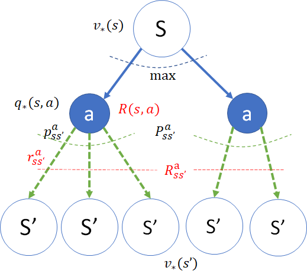
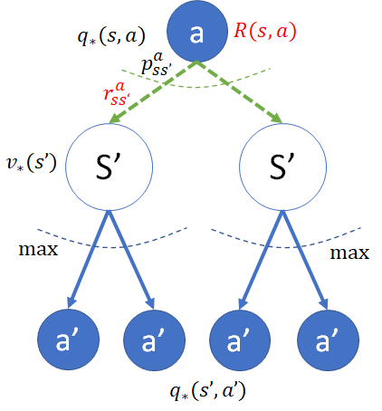

## 9.7 价值迭代

价值迭代（Value Iteration），是用动态规划通过多次迭代来计算最有价值函数的过程。

- 在 9.2 节中，计算了在随机策略下穿越虫洞问题的 $V_\pi, Q_\pi$；
- 在 9.5 节中，手工计算了简化版穿越虫洞问题的 $V_*,Q_*$；
- 在 9.6 节中，有了在最优策略下计算 $V_*,Q_*$ 的贝尔曼最优方程；
- 所以，在本节中，可以尝试解决寻找穿越虫洞问题的最优策略了。

但是，手工计算太复杂了，遇到求最大值的问题，还需要做很多假设，所以，本节中我们学习一下是否可以通过动态规划的方式来解决问题。


### 9.7.1 迭代算法

#### 算法描述

把 8.6.2 节中的算法拿过来，稍微改动一下。

【算法 9.7】计算最优价值函数。

---

定义误差 $\varepsilon$
初始化 $V_*(s),Q_*(s,a) \leftarrow 0$
循环：
　　保存备份以检查收敛性 $V_{old}(s) \leftarrow V_*(s)$
　　对每一个非终止状态的 $s \in S$：
　　　　获得动作空间 $A(s)$
　　　　对于每个动作 $a \in A(s)$:
　　　　　　获得转移概率 $p$, 下游状态 $s'$，奖励 $r$
　　　　　　计算 $q_*(s,a)=\sum\limits_{s'} p \big [r+\gamma v_*(s') \big ]$
　　　　　　存放到数组 $Q_*(s,a) \leftarrow q_*(s,a)$
　　　　$v_*(s) \leftarrow \max\limits_a[Q_*(s,a)]$，即指定状态下所有 $a$ 的最大 $Q$ 值
　　　　存放到数组 $V_*(s) \leftarrow v_*(s)$
　　检查收敛性, 如果 $\max(|V_{old} - V_*|) < \varepsilon$ 则退出循环
返回 $V_*(s),Q_*(s,a)$

---

这个算法与算法 8.6 的区别是：
1. 没有策略 $\pi$ 输入，因为该算法是要寻找最优策略；
2. 从 $q_\pi$ 计算 $v_\pi$ 时不用公式 $v_\pi(s) = \sum_{a \in A(s)} \pi(a|s)q_\pi(s,a)$，而是直接取最大值 $v_*(s) = \max_a[Q_*(s,a)]$。


#### 计算单个 $q_*$

计算 $q_*$ 的公式与计算 $q_\pi$ 的一样，所以代码也一样。

```python
# 式 (9.6.1) 计算 q，假设已知 v*(s')
def q_star(p_s_r, gamma, V):
    q = 0
    # 遍历每个转移概率,以计算 q
    for p, s_next, r in p_s_r:
        # math: \sum_{s'} p_{ss'}^a [ r_{ss'}^a + \gamma *  v_{\pi}(s')]
        q += p * (r + gamma * V[s_next])
    return q
```

输入参数：

- p_s_r：是转移概率 P、下游状态 S、奖励 R 的缩写，是一种数据结构定义，在前面有说明。
- gamma：折扣值。
- V：最优状态价值函数数组 $V_*$。

返回值：指定状态 s 和动作 a 的动作价值函数 $q_*(s,a)$。

#### 计算单个 $v_*$

计算 $v_*$ 的公式与计算 $v_\pi$ 的不一样，最大的区别有两点：

1. 输入参数中不需要 policy 策略参数，因为我们可以从这个算法中直接得到最优策略。
2. 不需要累积 q 值来计算 v 值，而是直接返回 q 值中的最大者。

代码如下：

```python
# 式 (9.6.3) 计算 v*
def v_star(s, actions, gamma, V, Q):
    list_q = []                     # 准备列表记录所有下游的 q*
    for a, p_s_r in actions:        # 遍历每个动作以计算q值，进而计算v值
        q = q_star(p_s_r, gamma, V) # 计算 q*
        list_q.append(q)            # 加入列表
        Q[s,a] = q                  # 记录下每一个q(s,a)值,不需要再单独计算一次
    return max(list_q)              # 返回几个q*中的最大值,即 v=max(q)
```

输入参数：

- s：指定状态。
- actions：指定状态下的动作空间。
- gamma：折扣。
- V：最优状态价值函数数组 $V_*$。
- Q：最优动作价值函数数组 $Q_*$。

返回值：几个最优动作价值函数值中的最大值 $v_*(s)=\max[q_*(s,a)]$。

#### 用迭代法计算 $V_*,Q_*$

实现算法 9.7.1。

【代码位置】Algorithm.Algo_OptimalValueFunction.py

```python
def calculate_VQ_star(env, gamma, max_iteration):
    V = np.zeros(env.nS)            # 0初始化V*(s)
    Q = np.zeros((env.nS, env.nA))  # 0初始化Q*(s,a)
    count = 0                       # 记录迭代次数
    # 迭代
    while (count < max_iteration):
        V_old = V.copy()                            # 保存备份便于检查收敛性
        for s in range(env.nS):                     # 遍历所有状态s
            if env.is_end(s):                       # 终止状态v=0
                continue            
            actions = env.get_actions(s)            # 获得动作空间
            V[s] = v_star(s, actions, gamma, V, Q)  # 计算V*,Q*
        if abs(V-V_old).max() < 1e-4:               # 检查收敛性
            break
        count += 1
    # end while
    print("迭代次数 = ",count)
    return V, Q
```

### 9.7.2 过程与结果

#### 数据与模型

数据定义与模型逻辑仍然使用和计算 $V_\pi,Q_\pi$ 时同样的代码，在 9.2.2 节也说过了，这种设计可以高度复用，这时就能看出它的好处了。

【代码位置】Wormhole_91_Data.py, GridWorld_Model.py

#### 主过程

【代码位置】Wormhole_97_VQ_star.py

```python
import numpy as np
import Wormhole_0_Data as data              # 数据定义
import GridWorld_Model as model             # 模型逻辑
import Algo_OptimalValueFunction as algo    # 算法实现
import DrawQpi as drawQ                     # 结果输出

if __name__=="__main__":
    env = model.GridWorld(
        # 关于状态的参数
        data.GridWidth, data.GridHeight, data.StartStates, data.EndStates,  
        # 关于动作的参数
        data.Actions, data.Policy, data.SlipProbs,                     
        # 关于奖励的参数
        data.StepReward, data.SpecialReward,                     
        # 关于移动的限制 
        data.SpecialMove, data.Blocks)                        
    model.print_P(env.P_S_R)
    gamma = 0.9 # 折扣，在本例中用1.0可以收敛，但是用0.9比较保险
    iteration = 1000    # 算法最大迭代次数
    V_star, Q_star = algo.calculate_VQ_star(env, gamma, iteration)  # 原地更新的迭代算法
    print("V*")
    V = np.reshape(np.round(V_star,2), (data.GridWidth, data.GridHeight))
    print(V)
    print("Q*")
    print(np.round(Q_star,2))
    # 字符图形化显示
    drawQ.draw(Q_star, (data.GridWidth, data.GridHeight))
```

#### 运行结果

$V_*$ 的结果如图 9.7.1 所示。

<center>


图 9.7.1 穿越虫洞问题的最优状态价值函数值
</center>

以 $s_{17}$ 为例，它本身的 $v_*$ 值为 21.2，“人往高处走”，下一步，智能体会从 $s_{17}$ 走到相邻方格的 $v_*$ 比较高的方向，也就是 $s_{16},s_{22}$。

笔者特意给具有相同值的方格画了连线，整体上看，这些连线形成了一种类似梯度的形状，表示最优状态价值函数的一种变化趋势。


$Q_*$ 的结果如图 9.7.2 所示。


<center>


图 9.7.2 穿越虫洞问题的最优策略
（左图：最优动作价值；右图：最佳动作方向，即策略）
</center>

- 仍以 $s_{17}$ 为例，其“左上右下”四个方向的最优动作价值为 21.2, 17.2, 17.2, 21.2，所以它会引导智能体向下或者向左移动。
- 靠近边界的方格都会有向内部移动的趋势。
- $s_1,s_{21}$ 向任意方向移动都会导致穿越，所以无所谓。
- $s_{10},s_{11},s_{12},s_{13},s_{14}$ 这一行处于中间地带，最佳动作都是向下方的 $s_{21}$ 移动，而不是向奖励相对较小的 $s_1$ 移动。

#### 提取策略

提取策略的方法就是扫描 $Q(S,A)$ 的每一个状态 $s$，从该状态的几个动作中取出最大值，然后给最大值所在的位置置 1，其它位置置 0。如果有几个相同的最大值则同时置 1。

由于是最优策略，所以策略的值是非 0 即 1（硬策略），而不是概率（软策略）。最终得到的策略数组如下：

```
[[[0. 0. 1. 0.], [1. 1. 1. 1.], [1. 0. 0. 0.], [1. 0. 0. 0.], [1. 0. 0. 0.]]
 [[0. 1. 1. 0.], [0. 1. 0. 0.], [1. 1. 0. 0.], [1. 1. 0. 0.], [1. 1. 0. 0.]]
 [[0. 0. 1. 1.], [0. 0. 0. 1.], [1. 0. 0. 1.], [1. 0. 0. 1.], [1. 0. 0. 1.]]
 [[0. 0. 1. 1.], [0. 0. 0. 1.], [1. 0. 0. 1.], [1. 0. 0. 1.], [1. 0. 0. 1.]]
 [[0. 0. 1. 0.], [1. 1. 1. 1.], [1. 0. 0. 0.], [1. 0. 0. 0.], [1. 0. 0. 0.]]]
```

格式化成 5x5 的方阵便于读者阅读。由于动作空间定义如下：

```python
# 动作空间
LEFT, UP, RIGHT, DOWN  = 0, 1, 2, 3
```
所以：
- [0, 0, 1, 0] 表示向右移动；
- [1, 1, 1, 1] 表示可以向任意四个方向移动，也可以写成 [0.25, 0.25, 0.25, 0.25]；
- [1, 1, 0, 0] 表示可以向左和上移动，也可以写成 [0.5, 0.5, 0, 0]。

以此类推。


### 9.7.3 策略改进定理

算法 9.7 的示意图如图 9.7.3 所示。

<center>


图 9.7.3 价值迭代示意图
</center>

算法执行步骤如下：

1. 初始化 V，Q 为 0，不妨命名它们为 $V_0(s), Q_0(s,a)$；
2. 用式（9.6.1）根据 $V_0$ 计算动作价值得到 $Q_1(s,a)=P^a_{ss'}[R^a_{ss'}+\gamma V_0(s')]$；
3. 用式（9.6.3）根据 $Q_1$ 取最大值得到 $V_1(s)=\max_a Q_1(s,a)$；
4. 用 $V_0$ 与 $V_1$ 比较，看看是否收敛（二者的差是否很小）；
4. 用式（9.6.1）根据 $V_1$ 计算动作价值得到 $Q_2$；
5. 用式（9.6.3）根据 $Q_1$ 取最大值得到 $V_2$；
6. 用 $V_1$ 与 $V_2$ 比较，看看是否收敛（二者的差是否很小）；
......

假设一共迭代了 $k$ 次，并判定为收敛，就会得到最优价值函数值 $V_*=V_k, Q_*=Q_k$，然后再从 $Q_*$ 中取出 $\pi_*(s)=\argmax_a Q_*(s,a)$ 即可得到最优策略。

在图 9.7.3 中，用两条虚线示意性地表示了 $V_k,Q_k$ 的前进方向，在实际问题中，当然不可能是以直线的方式，而是有一定的上下波动。最后两者交汇于一点，可以解释为 $v_*(s)=\max_a q_*(s,a)$。如果再继续迭代的话，两条虚线会合并成一条虚线继续向右侧延申，但是已经没有什么意义了。

为什么这种方法可以收敛到最优价值策略呢？

由 $q_\pi$ 的定义式（8.4.2）有：

$$
q_\pi(s,a) \doteq \mathbb E[ R_{t+1} + \gamma v_\pi(S_{t+1}) \mid S_t=s,A_t=a ] \tag{9.7.1}
$$

而一个贪心策略 $\pi'$ 的定义为：

$$
\begin{aligned}
\pi'(s) & \doteq \argmax_a q_\pi(s,a)
\\
&=\argmax_a \mathbb E[ R_{t+1} + \gamma v_\pi(S_{t+1}) \mid S_t=s,A_t=a ]
\end{aligned}
\tag{9.7.2}
$$

其含义是按当前策略 $\pi$ 计算出 $q_\pi(s,a)$ 后，取其中的最大值得到新的策略并命名为 $\pi'$。从 $\pi'(s)$ 会得到新的动作选择 $a' \in A(s)$，但是 $a'$ 这种表述方式含义不明确，所以仍然用 $\pi'(s)$ 来表示。然后计算新的 $q_\pi(s,\pi'(s))$：

$$
\begin{aligned}
q_\pi(s,\pi'(s))&=\max_{a \in A} q_\pi(s,a) & (1)
\\
&\ge q_\pi(s,\pi(s)) &(2)
\\
&\ge v_\pi(s) & (3)
\end{aligned}
\tag{9.7.3}
$$

- 子式（2）的含义是，由于 $\pi'(s)$ 为贪心策略，$q_\pi(s,\pi'(s))$ 为 $q_\pi(s,a)$ 中的最大值，所以一定会大于任意一个动作的价值 $q_\pi(s,\pi(s))$。
- 子式（3）是根据式（8.4.3）：$v_\pi(s)=\sum_{a \in A(s)} \pi(a | s) q_\pi(s,a)$，所以 $v_\pi(s)$ 一定会小于等于 $q_\pi(s,\pi(s))$。在有些资料中把最后一个大于等于号写成了等于号，笔者认为不够严谨。

接下来，根据式（9.7.3）反向应用，再把式（9.7.1）和式（9.7.2）本身不断地代入，得到连续的不等式如下：

$$
\begin{aligned}
v_\pi(s) & \le q_\pi(s,\pi'(s))
\\
(式9.7.1 \to)&=\mathbb E \big [ R_{t+1} + \gamma v_\pi(S_{t+1}) \mid S_t=s,A_t=\pi'(s)\big]
\\
(消去A_t条件\to)&=\mathbb E_{\pi'} \big[ R_{t+1} + \gamma v_\pi(S_{t+1}) \mid S_t=s\big]
\\
(式9.7.3 \to)& \le \mathbb E_{\pi'} \big[ R_{t+1} + \gamma q_\pi(S_{t+1},\pi'(S_{t+1})) \mid S_t=s]
\\
(式9.7.1 \to)&=\mathbb E_{\pi'} \big[ R_{t+1} + \gamma \mathbb E_{\pi'}[R_{t+2}+\gamma v_\pi(S_{t+2})|S_{t+1},A_{t+1}=\pi'(S_{t+1})] \mid S_t=s\big]
\\
(消去A_t条件\to)&=\mathbb E_{\pi'} \big[ R_{t+1} + \gamma R_{t+2} + \gamma^2 v_\pi(S_{t+2}) \mid S_t=s\big]
\\
(式9.7.3 \to)& \le \mathbb E_{\pi'} \big[ R_{t+1} + \gamma R_{t+2} + \gamma^2 R_{t+3} + \gamma^3 v_\pi(S_{t+3}) \mid S_t=s\big]
\\
& \vdots
\\
& \le \mathbb E_{\pi'} \big[ R_{t+1} + \gamma R_{t+2} + \gamma^2 R_{t+3} + \gamma^3R_{t+4}+\cdots \mid S_t=s\big]
\\
&=v_{\pi'}(s)
\end{aligned}
\tag{9.7.4}
$$

结论是 $v_\pi(s) \le v_{\pi'}(s)$，即旧策略 $\pi$ 下的状态价值函数会小于等于新策略 $\pi'$ 下的状态价值函数，这样的话，不断地在每个状态上采用新策略，整体的策略（组）就会不断趋近于最优策略，并最终收敛。

### 9.7.4 二级回溯

同 $V_\pi,Q_\pi$ 一样（见 8.6.4 节），$V_*,Q_*$ 也有二级回溯，即，可以用 $V_*(s')$ 来表示 $V_*(s)$，也可以用 $Q_*(s',a')$ 来表示 $Q_*(s,a)$。


#### $v_*(s)$ 的迭代表达式

<center>


图 9.7.3 最优状态价值函数 $V*$ 的二级回溯图
</center>

如图 9.7.3，$v_*(s)$ 会取左右两侧较大的那个 $q_*(s,a)$ 来作为自己的值，读者不妨假设是左侧的 $q_*$ 较大，然后将式（9.6.1）代入式（9.6.3），从而消去 $q_*(s,a)$，推导出式（9.7.1）：

$$
\begin{aligned}
v_*(s) &= \max_{a \in A(s)}\Big[ q_*(s,a) \Big]
\\
&=\max_{a \in A(s)} \Big[ \sum_{s'} p_{ss'}^a [r_{ss'}^a+\gamma v_*(s')] \Big] &(1)
\\
&=\max_{a \in A(s)} \Big[  R(s,a)+ \gamma \sum_{s'} p_{ss'}^a  v_*(s') \Big] &(2)
\end{aligned}
\tag{9.7.1}
$$

子式（1）和子式（2）两种形式，都可以使用，取决于问题中的奖励函数的设定。

#### $q_*(s,a)$ 的迭代表达式

<center>


图 9.7.4 最优动作价值函数 $Q*$ 的二级回溯图
</center>

如图 9.7.4，$q_*(s)$ 会取左右两侧 $v_*(s')$ 的加权平均值，将式（9.6.3）代入式（9.6.1），从而消去 $v_*(s)$，推导出式（9.7.2）：


$$
\begin{aligned}
q_*(s,a) 
&=\sum_{s'} p_{ss'}^a [r_{ss'}^a+\gamma v_*(s')]
\\
&=\sum_{s'} p_{ss'}^a [r_{ss'}^a+\gamma \max q_*(s',a')] &(1)
\\
&=\sum_{s'} p^a_{ss'} r^a_{ss'} + \gamma \sum_{s'} p^a_{ss'} [\max_{a'} q_*(s',a')] &(2)
\\
&=R(s,a) + \gamma \sum_{s'} p_{ss'}^a [\max q_*(s',a')] &(3)
\end{aligned}
\tag{9.7.2}
$$

式（9.7.2）实际上是在每个状态 $s'$ 的下游动作上，都取了一次 $\max$ 操作，作为对应的 $s'$ 的 $v_*(s')$ 值，然后再做加权平均。

子式（1,2,3）三种形式都可以使用，取决于问题中的奖励函数的设定。

### 思考与练习
