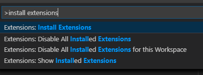
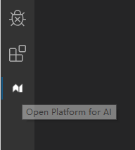
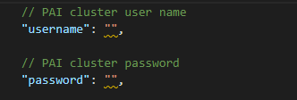
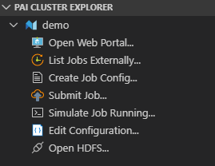
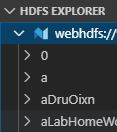
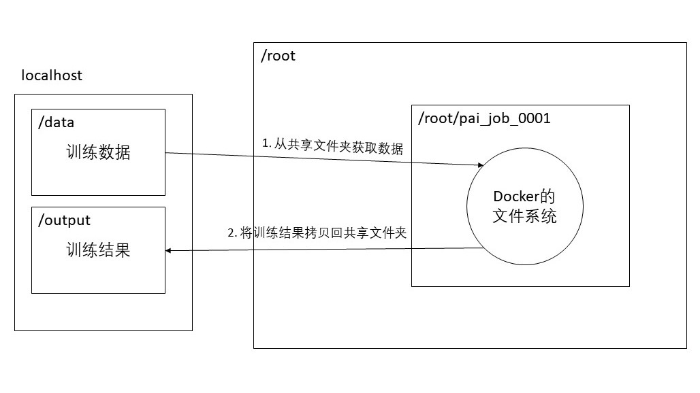
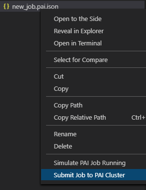

# 在OpenPAI上训练

> [OpenPAI](https://github.com/microsoft/pai/blob/master/README.md#open-platform-for-ai-openpai-)作为开源平台，提供了完整的 AI 模型训练和资源管理能力，能轻松扩展，并支持各种规模的私有部署、云和混合环境。
> ## 适用场景
> 1. 在团队间共享强大的 AI 计算资源（例如，GPU、FPGA 集群）。
> 2. 在组织内共享或重用 AI 资产（如模型、数据、运行环境等) 。
> 3. 构建易于 IT 运维管理的 AI 计算平台。
> 4. 在同一个环境中完成模型训练过程。
> 
> [了解更多](https://github.com/microsoft/pai/blob/master/README_zh_CN.md#ai-%E5%BC%80%E6%94%BE%E5%B9%B3%E5%8F%B0openpai-)


## 前提准备
在开始之前，我们需要在服务器上[部署OpenPAI](https://github.com/microsoft/pai/blob/master/README_zh_CN.md#%E9%83%A8%E7%BD%B2)，并注册一个OpenPAI账号。

### 安装OpenPAI的VS Code插件
为了方便我们提交任务到OpenPAI上，我们可以使用VS Code中的插件`OpenPAI VS Code Client`（在Marketplace中[查看该插件](https://marketplace.visualstudio.com/items?itemName=OpenPAIVSCodeClient.pai-vscode)）。

1. 按F1，输入“install extensions”，选择 `Extensions: Install Extensions` 。

    


2. 搜索“openpai”，选择 `OpenPAI VS Code Client` ，点击“Install”即可完成安装。

    


3. 安装完成后，左侧边栏可以看到OpenPAI的图标。
   
   

### 配置OpenPAI账号信息

1. 点击侧边栏 `PAI CLUSTER EXPLORER` 的“+”号。或者，按`F1`后，输入“Add Pai Cluster”，选择`PAI:Add Pai Cluster`。

    


2. 输入OpenPAI的服务器IP后回车，会自动生成一份配置文件，我们需要修改文件中的`username`和`password`字段为自己的账号密码，保存文件即可。

    

3. 此时，按“Ctrl+Shift+E”后，我们可以看到侧边栏 `PAI CLUSTER EXPLORER` 中会显示已经登录的服务器。

    

    点击侧边栏的OpenPAI的图标，我们可以在 `HDFS EXPLORER` 中看到已登录的服务器的资源，可以新建文件夹或上传文件。

    


至此，我们就成功完成了登录。

## 数据访问

OpenPAI的每一个任务是通过创建一个独立的Docker环境进行的，Docker的文件系统与服务器的文件系统是隔离的，所以在Docker中无法通过相对路径或绝对路径直接访问到我们需要训练的数据。数据访问主要有共享文件夹，直接内置文件到 Docker 映像中，或复制进出 Docker 容器这几种方式。

详细操作请参考：[通用流程](https://github.com/microsoft/pai/blob/master/docs/zh_CN/user/storage.md#通用流程)

### 共享文件夹
我们可以通过把共享文件夹挂载到Docker中，从而实现对数据的访问。具体流程可以参考下图。




为了方便起见，我们将`usr_dir`和`data_dir`合并为一个文件夹，目录结构如下。

```
data \
    __init__.py
    merge_vocab.py
    train.txt.up.clean
    train.txt.down.clean
    merge.txt.vocab.clean
```

但是，需要注意的是，在后续训练的目录定义中，需要将`t2t_usr_dir`和`data_dir`都指定为该data目录。

在这里我们需要共享data文件夹，并挂载到Docker上即可开始训练，挂载的方式会在后续配置任务时提到。

### HDFS提交

>OpenPAI 部署了一个 HDFS 服务来保存日志和其它文件。 虽然此 HDFS 也可用来存储文件，但**不推荐**这样做。 因为 OpenPAI 集群的服务器可能会频繁增减，磁盘空间也有可能不够，因此无法保证存储的质量。
>
>对于一些非常小的集群，如果管理员就是用户，可以使用此 HDFS 来简化部署。 但同时应考虑上述风险。

具体请参考：[使用HDFS提交任务](./hdfs.md)

## 提交训练任务

### 配置任务

首先，我们新建任务配置文件`new_job.pai.json`。

```
{
    "jobName": "train_couplet_demo",
    "image": "vzich/poet:tensorflow",
    "codeDir": "$PAI_DEFAULT_FS_URI/$PAI_USER_NAME/$PAI_JOB_NAME",
    "taskRoles": [
        {
            "name": "demo_001",
            "taskNumber": 1,
            "cpuNumber": 2,
            "gpuNumber": 1,
            "memoryMB": 8192,
            "command": "apt update && apt install -y cifs-utils && mkdir /models && mount -t cifs //<AddressOfSharedServer>/<SharedFolder> /models -o username=<Username>,password=<Password> && cd /models && pip3 --quiet install future && chmod +x train.sh && train.sh"
        }
    ]
}
```

开始前应先替换所有变量为相应的值，包括：\<AddressOfSharedServer\>，\<SharedFolder\>，\<Username\>，以及 \<Password\>。


其中`taskRoles`字段下的`command`为openPAI创建完Docker环境后开始执行的命令，`image`字段用于指定docker hub中的Docker镜像。


`command`字段分为以下几步：

1. **准备环境**。`apt update && apt install -y cifs-utils` 安装了 `cifs-utils` 来挂载代码文件夹。
如果将所有依赖都包含在 Docker 映像中，可以在每次运行前省下下载和安装时间。 但如果这些依赖更新得非常频繁，或不同的 Job 需要大量的依赖，则可以在 Job 运行时安装。

2. **准备文件**。 `mkdir /models && mount -t cifs //<AddressOfSharedServer>/<SharedFolder> /models -o username=<UserName>,password=<Password> && cd /models`，挂在了包含代码的共享文件夹。如果还有其它文件夹包含了数据或模型，也可以在此挂载上。

3. **执行核心逻辑**。 由于训练的命令比较多，此处我们将训练的核心逻辑写在了[train.sh](./src/train_on_pai/train.sh)文件里（后续会提到），利用`chmod +x train.sh && train.sh`运行训练脚本`train.sh`。

4. **保存输出**。 Docker 容器会在每次 Job 完成后被删除。 因此，如果需要任何结果文件，要将其保存到 Docker 容器之外。`train.sh`脚本中将训练后的模型和检查点都保存在了共享文件夹`models/output`。


#### 训练脚本 `train.sh`

此为用于训练的脚本，包含了tensor2tensor的安装，以及执行训练的命令。

我们需要将`train.sh`放到我们的共享文件夹`data`里，方便提交任务后自动运行该脚本。

```
#!/bin/bash
HOME_DIR=$(cd `dirname $0`; pwd)
echo $HOME_DIR
cd $HOME_DIR
    
# install tensor2tensor
export LC_ALL=C
pip3 install tensor2tensor==1.14.1
pip3 install requests==2.21.0

# set environment
TRAIN_DIR=${HOME_DIR}/output
LOG_DIR=${TRAIN_DIR}
DATA_DIR=${HOME_DIR}/data
USR_DIR=${DATA_DIR}

PROBLEM=translate_up2down
MODEL=transformer
HPARAMS_SET=transformer_small

mkdir -p ${TRAIN_DIR}

# generate data
echo start generate data...

t2t-datagen \
--t2t_usr_dir=${USR_DIR} \
--data_dir=${DATA_DIR} \
--problem=${PROBLEM}

# train model
setting=default

echo start training...

t2t-trainer \
--t2t_usr_dir=${USR_DIR} \
--data_dir=${DATA_DIR} \
--problem=${PROBLEM} \
--model=${MODEL} \
--hparams_set=${HPARAMS_SET} \
--output_dir=${TRAIN_DIR} \
--keep_checkpoint_max=1000 \
--worker_gpu=1 \
--train_steps=200000 \
--save_checkpoints_secs=1800 \
--schedule=train \
--worker_gpu_memory_fraction=0.95 \
--hparams="batch_size=1024" 2>&1 | tee -a ${LOG_DIR}/train_${setting}.log

```


### 提交任务

右键`new_job.pai.json`，选择`Submit Job to PAI Cluster`。



此时，就完成了任务的提交。

成功提交任务后，VS Code会将上一步新建的.sh文件同时上传至此次任务的目录，在Docker创建完后会自动执行`new_job.pai.json`文件中`taskRoles`下的`command`字段内容。


## 查看结果

在任务运行完成后，Docker会自动销毁，由于我们将训练结果保存至了共享文件夹的`output`目录，我们可以在`output`中找到我们的训练结果。

至此，我们便完成了OpenPAI的任务提交、训练以及获取训练结果啦。