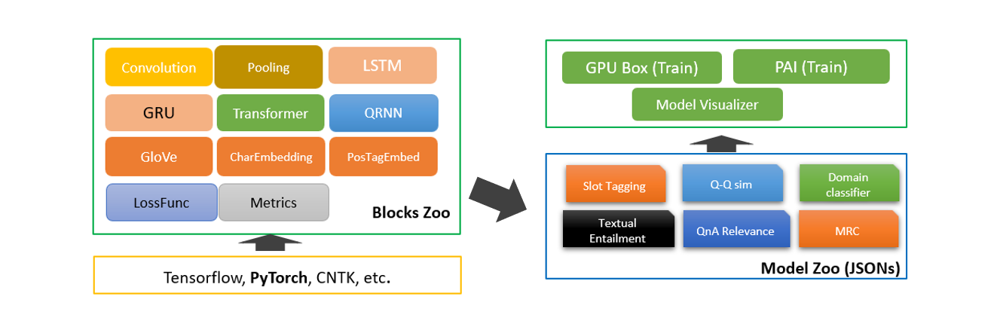
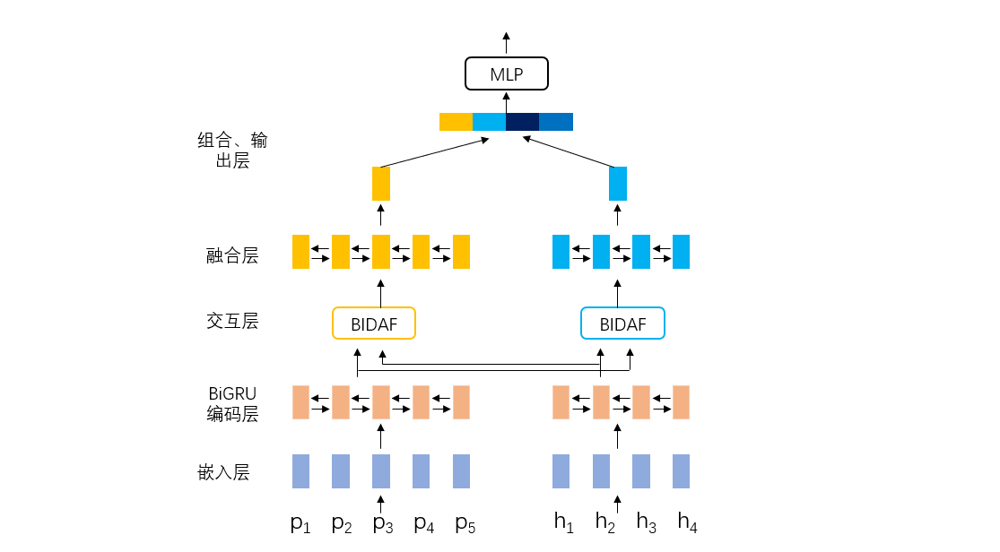
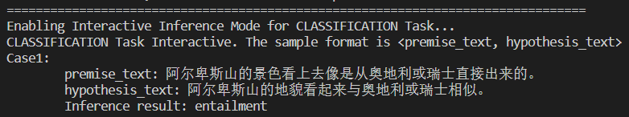

<h1> 快速构建中文文本蕴含深度学习模型-NeuronBlocks </h1>

文本间的推理关系，又称为文本蕴含关系，作为一种基本的文本间语义联系，广泛存在于自然语言文本中。很多自然语言处理任务或多或少地都需要面对包含蕴含关系的文本。Neuronlocks是一个模块化NLP深度学习建模工具包，可以帮助工程师/研究者们快速构建NLP任务的神经网络模型。本案例将介绍如何使用Neuronlocks进行文本蕴含模型的训练，包括数据获取与预处理、配置文件构建、模型训练、模型测试和模型推理。

# 案例介绍

随着自然语言处理(NLP)领域研究的不断深入，如何让机器能够真正地理解自然语言，而不是仅简单地处理语句的表层信息，渐渐成为了许多学者面临的问题。实现对文本深层次理解，是自然语言处理研究最主要也是最重要的目的之一。 
   
在获取了文本的语义后，一旦获得了它们之间的推理关系，这些文本便不再互相孤立，而是彼此联系起来，构成一张语义推理网络，从而促使机器能够真正理解并应用文本的语义信息。文本间的推理关系，又称为文本蕴含关系。作为一种基本的文本间语义联系，广泛存在于自然语言文本中。  

简单的来说文本蕴含关系描述的是两个文本之间的推理关系，其中一个文本作为前提，另一个文本作为假设，如果根据前提能够推理得出假设，那么就说两者之间存在蕴含关系。

正如以下两个句子，我们可以轻松地判断出两者之间存在蕴含关系，但如果用机器该如何进行判断呢？
 - 阿尔卑斯山的景色看上去像是从奥地利或瑞士直接出来的。
 - 阿尔卑斯山的地貌看起来与奥地利或瑞士相似。

本案例将会给大家介绍如何使用NeuronBlocks进行文本蕴含关系的分析

## 案例价值

- 可以了解中文文本蕴含(NLI)的基础内容
- 可以学会使用微软开源项目NeuronBlocks的使用方法
- 能利用NeuronBlocks快速构建、训练、测试你的NLI深度学习模型

## 使用场景
[文本蕴含技术](https://www.jiqizhixin.com/articles/2016-12-06-2)在众多语义相关的自然语言处理（NLP）任务和日常生活中有着广泛的应用。  

1. 在问答系统中，文本蕴含技术可以生成候选答案，或对用其他方法生成的候选答案进行筛选排序
2. 在机器翻译评价领域，可以利用机器译文和标准译文的互相蕴含程度来对机器翻译系统的性能进行评估
3. 在学生作业评分任务中，学生的作答与标准答案之间的蕴含关系也可以指示学生答案的完善程度等等。

## NeuronBlocks
为了提升构建自然语言理解深度学习模型的效率，微软推出了[NeuronBlocks](https://github.com/microsoft/NeuronBlocks)——自然语言处理任务的模块化深度学习建模工具包。  

目前，微软在GitHub上拥有3.9k个开源项目，是世界上最大的开源项目支持者。从底层的协议、编程语言，到各种框架、类库，再到应用工具，微软的开源贡献一直在持续。[微软开源项目入口](https://opensource.microsoft.com)

作为微软的开源项目之一，NeuronBlocks可帮助工程师、研究者们快速构建用于NLP任务的神经网络模型训练的端到端管道。该工具包的主要目标是将NLP深度神经网络模型构建的开发成本降到最低，包括训练阶段和推断阶段。NeuronBlocks由两个主要组件组成：Block Zoo和Model Zoo。Block Zoo提供常用的神经网络组件作为模型架构设计的构建模块，如BiLSTM、BiGRU、Transformer、CNN等；在Model Zoo中，针对常见的NLP分类任务，如情感分析、文本分类、序列标注、机器阅读理解等，以JSON配置文件的形式为其提供了一套NLP模型。更多详细信息，请查看[GitHub项目地址](https://github.com/microsoft/NeuronBlocks)。

本案例中，中文文本蕴含任务本质也是一种分类任务，所以我们选择Model Zoo来快速构建中文文本蕴含（NLI）深度学习算法模型。



# 先修知识
- 了解微软开源项目Neuronblocks  
参考链接： [NeuronBlocks](https://github.com/microsoft/NeuronBlocks)
- 了解主流深度学习框架  
参考链接： [Pytorch](https://pytorch.org/)


# 案例大纲与核心知识点
| 序号 |   内容  | 关键知识点 | 收获实战技能 |
|:---:|---------|------------|-------------|
| 1 | 配置环境与工具 | 虚拟环境与Pytorch | 使用虚拟环境安装Pytorch |
| 2 | 数据获取 | Python数据处理 | 使用Python对数据集处理 |
| 3 | 模型构建 | Neuronblocks / BiGRU | 使用Neuronblocks与BiGRU构建中文文本蕴含深度学习模型 |
| 4 | 模型训练 | Neuronblocks | 使用Neuronblocks进行模型训练 |
| 5 | 模型测试 | Neuronblocks | 使用Neuronblocks进行模型测试 |
| 6 | 模型推理 | Neuronblocks | 使用Neuronblocks进行模型推理 |


# 推荐学习时长
- 初次学习的实战者：5~8 小时
- 有一定经验学习者：3~5 小时 
- 模型训练时间：6~24小时


# 案例详解

## 环境与工具
本案列运行具有CPU的计算机上，系统可以是Windows / Macos / Linux
需要的软件环境如下：
- Python 3.7  
  
如果您有Nvidia的显卡，可以根据以下的Nvidia显卡算力表来查询您显卡的算力    
Nvidia显卡算力表： [CUDA GPU](https://developer.nvidia.com/zh-cn/cuda-gpus)

根据您显卡算力的不同，模型训练时间可以加快50-100倍。在后续的流程中，显卡流程将被折叠起来，请您根据折叠部分的提示，打开对应的折叠内容。

## 实现流程

### 配置环境与工具
1. 打开终端并选择合适的路径
    ```bash
    # 将YOUR_LIKE_PATH替换为你常用或合适的路径

    # Windows pwsh / Mac / Linux bash
    cd YOUR_LIKE_PATH
    ```

2. 将Microsoft开源项目NeuronBlocks Clone至本地，并进入该目录:
    ```bash
    git clone https://github.com/microsoft/NeuronBlocks.git
    cd NeuronBlocks
    ```
<details open>
<summary>如果您有Nvidia的显卡，请点击此处折叠CPU流程</summary>

3. 创建虚拟环境(可选)，安装Python依赖包
    ```bash
    # 可以选择你喜欢的虚拟环境管理方式

    # pipenv
    > pipenv shell --python 3.7
    > pip install nltk==3.5 gensim==3.8.3 tqdm==4.59.0 numpy==1.20.1 scikit-learn==0.24.1 ftfy==5.9 jieba==0.42.1
    > pip install torch==1.8.0+cpu torchvision==0.9.0+cpu -f https://download.pytorch.org/whl/torch_stable.html

    # conda (Windows)
    > conda create -n YOUR_ENV_NAME python=3.7
    > activate YOUR_ENV_NAME
    > pip install nltk==3.5 gensim==3.8.3 tqdm==4.59.0 numpy==1.20.1 scikit-learn==0.24.1 ftfy==5.9 jieba==0.42.1
    > pip install torch==1.8.0+cpu torchvision==0.9.0+cpu -f https://download.pytorch.org/whl/torch_stable.html

    # pip (无虚拟环境)
    > pip install nltk==3.5 gensim==3.8.3 tqdm==4.59.0 numpy==1.20.1 scikit-learn==0.24.1 ftfy==5.9 jieba==0.42.1
    > pip install torch==1.8.0+cpu torchvision==0.9.0+cpu -f https://download.pytorch.org/whl/torch_stable.html
    ```

4. 在安装后，我们的环境应该如下
    ```bash
    >pip list
    
    nltk==3.5
    gensim==3.8.3
    tqdm==4.59.0
    numpy==1.20.1
    scikit-learn==0.24.1
    ftfy==5.9
    jieba==0.42.1
    torch==1.8.0+cpu
    torchvision==0.9.0+cpu
    ```
</details>

<details>
<summary>如果您有Nvidia显卡，且算力大于3.5，请打开此折叠部分</summary>

3. 创建虚拟环境(可选)，安装Python依赖包
    ```bash
    # 可以选择你喜欢的虚拟环境管理方式

    # pipenv
    > pipenv shell --python 3.7
    > pip install nltk==3.5 gensim==3.8.3 tqdm==4.59.0 numpy==1.20.1 scikit-learn==0.24.1 ftfy==5.9 jieba==0.42.1
    > pip install torch==1.8.0+cu111 torchvision==0.9.0+cu111 -f https://download.pytorch.org/whl/torch_stable.html

    # conda (Windows)
    > conda create -n YOUR_ENV_NAME python=3.7
    > activate YOUR_ENV_NAME
    > pip install nltk==3.5 gensim==3.8.3 tqdm==4.59.0 numpy==1.20.1 scikit-learn==0.24.1 ftfy==5.9 jieba==0.42.1
    > pip install torch==1.8.0+cu111 torchvision==0.9.0+cu111 -f https://download.pytorch.org/whl/torch_stable.html

    # pip (无虚拟环境)
    > pip install nltk==3.5 gensim==3.8.3 tqdm==4.59.0 numpy==1.20.1 scikit-learn==0.24.1 ftfy==5.9 jieba==0.42.1
    > pip install torch==1.8.0+cu111 torchvision==0.9.0+cu111 -f https://download.pytorch.org/whl/torch_stable.html
    ```

4. 在安装后，我们的环境应该如下
    ```bash
    >pip list
    
    nltk==3.5
    gensim==3.8.3
    tqdm==4.59.0
    numpy==1.20.1
    scikit-learn==0.24.1
    ftfy==5.9
    jieba==0.42.1
    torch==1.8.0+cu111
    torchvision==0.9.0+cu111
    ```

</details>

<details>
<summary>如果您有Nvidia显卡，且算力小于等于3.5，请打开此折叠部分</summary>

3. 创建虚拟环境(可选)，安装Python依赖包
    ```bash
    # 可以选择你喜欢的虚拟环境管理方式

    # pipenv
    > pipenv install --python 3.7
    > pip install torch==1.2.0 torchvision==0.4.0 -f https://download.pytorch.org/whl/torch_stable.html

    # conda (Windows)
    > conda create -n YOUR_ENV_NAME python=3.7
    > activate YOUR_ENV_NAME
    > pip install -r requirements.txt
    > pip install torch==1.2.0 torchvision==0.4.0 -f https://download.pytorch.org/whl/torch_stable.html

    # pip (无虚拟环境)
    > pip install -r requirements.txt
    > pip install torch==1.2.0 torchvision==0.4.0 -f https://download.pytorch.org/whl/torch_stable.html
    ```

4. 在安装后，我们的环境应该如下
    ```bash
    >pip list
    
    nltk==3.4.1
    gensim==3.7.2
    tqdm==4.31.1
    numpy==1.16.3
    scikit-learn==0.20.3
    ftfy==5.5.1
    jieba==0.39
    torch==1.2.0
    torchvision==0.4.0
    ```

</details>

---

### 数据获取
我们利用的是开源的[中文文本蕴含数据集](https://github.com/liuhuanyong/ChineseTextualInference),数据集**train.txt**主要包含三种文本蕴含关系：**entailment、contradiction、 neutral**, 数据示例如下所示，第一个文本句子为为前提（premise），第二个文本句子为假设（hypothesis），其次是前提和假设的蕴含关系，每一行代表一个样本，以\t分隔。数据量级在42万左右，类别比例**entailment：contradiction：neutral = 1：1：1**，不存在数据类别不平衡问题。
| | | |
| - | - | - |
| 一个年轻人在呼啦圈。 | 这位老人正在呼啦圈。 | contradiction |
| 两个人正在大教堂或清真寺里交谈。 | 两个人在谈话 | entailment |
| 穿着黑色外套的妇女边看报纸边等着洗衣服。 | 一个女人在洗衣店。 | neutral |

<p/>

#### 数据下载并处理
首先我们先将数据集克隆到本地并启动python

```bash
git clone https://github.com/liuhuanyong/ChineseTextualInference.git
```
中文文本蕴含数据集只提供了train.txt，为了方便测试验证我们的模型，我们将该据集划分训练集、验证集、测试集。
```python
# 新建一个split_data.py，输入以下代码并运行即可划分好并放置在指定目录
import random
import os
dirs = "./dataset/chinese_nli/"
def split_data():
    samples = {"neutral": [], "contradiction": [], "entailment": []}
    with open("./ChineseTextualInference/data/train.txt", "r", encoding="utf-8") as fout:
        for line in fout:
            contents = line.strip().split("\t")
            if len(contents) < 3:
                continue
            samples[contents[-1]].append(line)
            print(
                f'neutral:{len(samples["neutral"])}, contradiction:{len    (samples["contradiction"])}, entailment: {le(samples   ["entailment"])}')
    def split_hepler(data):
        # 根据data的6：2：2划分train, dev, test
        length = len(data)
        train = data[: int(length * 0.6)]
        dev = data[int(length * 0.6): int(length * 0.8)]
        test = data[int(length * 0.8):]
        return train, dev, test
    def save_data(data, filename):
        with open(filename, "w", encoding="utf-8") as fout:
            for line in data:
                fout.write(line)
    # 数据按比例分开
    neu_train, neu_dev, neu_test = split_hepler(samples["neutral"])
    cont_train, cont_dev, cont_test = split_hepler(
        samples["contradiction"])
    ent_train, ent_dev, ent_test = split_hepler(samples["entailment"])
    # 将数据合并
    train = neu_train + cont_train + ent_train
    dev = neu_dev + cont_dev + ent_dev
    test = neu_test + cont_test + ent_test
    # 打乱数据
    random.shuffle(train)
    random.shuffle(dev)
    random.shuffle(test)
    # 保存需要测试的数据
    save_data(train, f"{dirs}cnli_train.txt")
    save_data(dev, f"{dirs}cnli_dev.txt")
    save_data(test, f"{dirs}cnli_test.txt")
if not os.path.exists(dirs):
    os.makedirs(dirs)
# 读取数据并处理统计
split_data()
```

#### 下载中文预训练词向量
运用已在大规模语料上预训练得到的中文词向量初始化词向量参数，提升模型的性能。我们此处选用的**搜狗新闻**语料预训练的**Word**300的词向量，下载并解压缩获得词向量文件**sgns.sogou.word**，词向量下载地址```https://github.com/Embedding/Chinese-Word-Vectors#pre-trained-chinese-word-vectors```。

### 模型构建

#### 模型整体架构
针对中文文本蕴含任务，本案例实现的是经典的循环神经网络+注意力方法模型，循环神经网络为[BiGRU](https://arxiv.org/abs/1406.1078)，注意力方法为[BIDAF](https://arxiv.org/abs/1611.01603)。模型主要包含以下几个模块：嵌入层、BiGRU编码层、注意力交互层、融合层、组合和输出层。接下来会进行详细讲解如何利用NeuronBlocks以Json文件的形式构建这些模块。模型结构如下图所示，p指的是前提（premise），h指的假设（hypothesis）


#### 嵌入层
嵌入层主要是将文本分词后，利用词表查找功能转化为相应的词向量，为后续模型的输入做准备。该层中以**Embedding**定义，**conf**设置词向量参数，本案例中我们使用搜狗新闻预训练得到的词向量，所以**dim**应与保持预训练的维度保持一致设为300，**cols**输入文本分别为前提（premise）和假设（hypothesis）。

```json
{
    "layer": "Embedding",
    "conf": {
      "word": {
        "cols": ["premise_text", "hypothesis_text"],
        "dim": 300
      }
    }
}
```

#### BiGRU编码层
双向GRU对向量化后的premise和hypothesis进行编码，获得更高层的语义信息表示。

设置模型输入，例如premise_text经过向量化变为premise
```json
"model_inputs": {
      "premise": ["premise_text"],
      "hypothesis": ["hypothesis_text"]
}
```

对premise和hypothesis进行dropout操作，可以设置dropout系数
```json
{
    "layer_id": "premise_dropout",
    "layer": "Dropout",
    "conf": {
        "dropout": 0
    },
    "inputs": ["premise"]
},
{
    "layer_id": "hypothesis_dropout",
    "layer": "Dropout",
    "conf": {
        "dropout": 0
    },
    "inputs": ["hypothesis"]
},
```

利用BiGRU对dropout后的premise进行编码，此处可设置其隐藏层节点大小，层数，dropout系数等
```json
{
    "layer_id": "premise_bigru",
    "layer": "BiGRU",
    "conf": {
        "hidden_dim": 128,
        "dropout": 0.3,
        "num_layers": 2
    },
    "inputs": ["premise_dropout"]
},
```

利用对premise编码的BiGRU对hypothesis再次编码，两者共享参数。
```json
{
    "layer_id": "hypothesis_bigru",
    "layer": "premise_bigru",
    "inputs": ["hypothesis_dropout"]
},
```

#### 交互层
BiAttFlow注意力方法使premise和hypothesis进行交互，得到premise和hypothesis信息相互感知的上下文表征。

```json
{
    "layer_id": "premise_attn",
    "layer": "BiAttFlow",
    "conf": {
    },
    "inputs": ["premise_bigru","hypothesis_bigru"]
},
{
    "layer_id": "hypothesis_attn",
    "layer": "BiAttFlow",
    "conf": {
    },
    "inputs": ["hypothesis_bigru", "premise_bigru"]
}

```

#### 融合层
BiGRU对交互后premise和hypothesis再次编码，使两者信息融合得更加充分。

```json
{
    "layer_id": "premise_bigru_final",
    "layer": "BiGRU",
    "conf": {
        "hidden_dim": 128,
        "num_layers": 1
    },
    "inputs": ["premise_attn"]
},
{
    "layer_id": "hypothesis_bigru_final",
    "layer": "BiGRU",
    "conf": {
        "hidden_dim": 128,
        "num_layers": 1
    },
    "inputs": ["hypothesis_attn"]
}

```

#### 组合、输出层
premise 和 hypothesis 最大化池化操作，得到对应的句子向量
```json
{
    "layer_id": "premise_pooling",
    "layer": "Pooling",
    "conf": {
      "pool_axis": 1,
      "pool_type": "max"
    },
    "inputs": ["premise_bigru_final"]
},
{
    "layer_id": "hypothesis_pooling",
    "layer": "Pooling",
    "conf": {
      "pool_axis": 1,
      "pool_type": "max"
    },
    "inputs": ["hypothesis_bigru_final"]
},
```

premise 和 hypothesis 拼接、做差、点积，获得两者的语义向量表示，输入到多层感知机中进行分类。
```json
{
    "layer_id": "comb",
    "layer": "Combination",
    "conf": {
        "operations": ["origin", "difference", "dot_multiply"]
    },
    "inputs": ["premise_pooling", "hypothesis_pooling"]
},
{
    "output_layer_flag": true,
    "layer_id": "output",
    "layer": "Linear",
    "conf": {
      "hidden_dim": [128, 3],
      "activation": "PReLU",
      "batch_norm": true,
      "last_hidden_activation": false
    },
    "inputs": ["comb"]
}
```

模型损失函数
```json
"loss": {
"losses": [
  {
    "type": "CrossEntropyLoss",
    "conf": {
      "size_average": true
    },
    "inputs": ["output","label"]
  }
]
},
```

模型评价指标
```json
"metrics": ["accuracy"]
```

#### 模型其他参数设置
到此我们将模型结构用Json参数的形式构建完成，这里来设置模型的其他一些重要参数


NeuronBlocks支持英文和中文
```json
"language": "Chinese",
```
训练集、验证集、测试集文件路径及预训练词向量的文件路径
```json
"inputs": {
"use_cache": false,
"dataset_type": "classification",
"data_paths": {
  "train_data_path": "./dataset/chinese_nli/cnli_train.txt",
  "valid_data_path": "./dataset/chinese_nli/cnli_dev.txt",
  "test_data_path": "./dataset/chinese_nli/cnli_test.txt",
  "predict_data_path": "./dataset/chinese_nli/cnli_test.txt",
  "pre_trained_emb": "./dataset/sogou_embed/sgns.sogou.word"
}
```
优化器、学习率、批次大小，训练轮数等超参数设置
```json
"optimizer": {
  "name": "SGD",
  "params": {
    "lr": 0.2,
    "momentum": 0.9,
    "nesterov": true
  }
},
"lr_decay": 0.95,
"minimum_lr": 0.005,
"epoch_start_lr_decay": 1,
"use_gpu": false,
"batch_size": 64,
"batch_num_to_show_results": 100,
"max_epoch": 6,
"steps_per_validation": 1000,
"max_lengths": {
    "premise": 32,
    "hypothesis": 32
}
```

#### 配置文件检查
模型配置文件的定义可以参考[Neuronblocks官方教程](https://github.com/microsoft/NeuronBlocks/blob/master/Tutorial_zh_CN.md#define-conf)  
已配置好的文件可以参考
[conf_chinese_nli_bigru_biAttnflow.json](./resources/conf_chinese_nli_bigru_biAttnflow.json)

<details>
<summary>如果您有Nvidia的显卡，请打开该折叠部分，并完成</summary>

将配置文件中的`use_gpu`从`false`修改为`true`
```bash
#第66行

#修改前
"use_gpu": false,

#修改后
"use_gpu": true,
```

</details>

### 代码修改
Pytorch 1.8对一些旧特性不再支持，我们需要对源代码做一些调整  
[pytorch/pytorch#43227](https://github.com/pytorch/pytorch/issues/43227)
```python3
# ./block_zoo/BiGRU.py 第85行
#在str_len后增加.cpu()

#修改前
string_packed = nn.utils.rnn.pack_padded_sequence(string, str_len, batch_first=True)

#修改后
string_packed = nn.utils.rnn.pack_padded_sequence(string, str_len.cpu(), batch_first=True)


# ./block_zoo/attentions/BiAttFlow.py 第55行
# 将注释取消

#修改前
# self.W = nn.Linear(layer_conf.input_dims[0][-1]*3, 1)

#修改后
self.W = nn.Linear(layer_conf.input_dims[0][-1]*3, 1)
```

### 模型训练
*提示: 在下文中, **PROJECTROOT**表示本项目的根目录。*

1. 数据准备： 
    - 划分后的训练集、验证集、测试集放置在指定的 `PROJECTROOT/dataset/chinese_nli/` 目录下
    - 预训练词向量放在 `PROJECTROOT/dataset/sogou_embed/` 目录
 
 
2. Json文件准备：Json模型配置文件放在 `PROJECTROOT/model_zoo/nlp_tasks/chinese_nli/`


3. 训练中文文本蕴含任务模型：
    - 进入`PROJECTROOT`目录下
    - 命令行运行命令：
    ```bash
    python train.py --conf_path=model_zoo/nlp_tasks/chinese_nli/conf_chinese_nli_bigru_biAttnflow.json

    #------------------------------------------------------#
    # 如果你有多张显卡，你可以用以下方法指定运行的显卡
    CUDA_VISIBLE_DEVICES=1 

    python train.py --conf_path=model_zoo/nlp_tasks/chinese_nli/conf_chinese_nli_bigru_biAttnflow.json
    #------------------------------------------------------#
    ```

4. 训练模型日志部分展示：
```log
2021-02-07 22:35:03,630 INFO LearningMachine.py train 314: Epoch 1 batch idx: 1900; lr: 0.200000; since last log, loss=0.875404; accuracy: 0.589375
2021-02-07 22:35:18,388 INFO LearningMachine.py train 322: Valid & Test : Epoch 1
2021-02-07 22:35:18,391 INFO LearningMachine.py evaluate 408: Starting valid ...
2021-02-07 22:35:18,391 INFO corpus_utils.py get_batches 237: Start making batches
2021-02-07 22:35:20,321 INFO corpus_utils.py get_batches 398: Batches got!
2021-02-07 22:36:33,065 INFO LearningMachine.py evaluate 619: Epoch 1, valid accuracy: 0.591011 loss: 0.873733
```

### 模型测试
1. 进入`PROJECTROOT`目录下
2. 运行命令：
    ```bash
    python test.py --conf_path=model_zoo/nlp_tasks/chinese_nli/conf_chinese_nli_bigru_biAttnflow.json
    ```

### 模型推理
1. 进入`PROJECTROOT`目录下
2. 运行命令：
    ```bash
    python predict.py --conf_path=model_zoo/nlp_tasks/chinese_nli/conf_chinese_nli_bigru_biAttnflow.json --predict_mode='interactive'
    ```
3. 分别输入两个文本，程序将会判断两个文本之间的关系。
4. 结果展示  
    


# 作业和挑战
1. 对双向注意力**BIDAF**的原理熟练掌握
2. 超参数对于模型的最终性能非常关键，请为本案例设计出最优的超参数。如调整学习率、批次大小、训练轮数、dropout等，并分析其重要性
3. 思考案例采用模型的优点和不足，可从模型的运行效率和性能方面简要分析


# 总结
首先我们对环境进行了配置，并对需要用到的数据进行了获取和划分。随后，我们通过配置文件的方式来快速构建文本蕴含的模型，并进一步进行了训练、测试划分。在整个流程中只有数据的获取和划分需要自己进行一定的编程。Neuronblocks对工作量的减少功不可没。

本案例仅是初步介绍了Neuronblocks工具的使用方法，如果读者希望能更加广泛的应用Neuronblocks在NLP的研究中，可以参考Neuronblocks的[官方教程](https://github.com/microsoft/NeuronBlocks/blob/master/Tutorial_zh_CN.md)

# 推荐阅读

## 前沿研究
最近，在自然语言处理（NLP）领域中，使用语言模型预训练方法在多项 NLP任务（情感分析、文本蕴含、机器阅读理解等）都取得了突破性的提升，广泛受到了各界的关注。如BERT（Bidirectional Encoder Representations from Transformer）一个基于 Transformer 实现的双向编码器来提取输入序列特征信息的预训练模型，一经问世就横扫11项NLP任务。除了BERT，常见的预训练模型还有GPT、RoBERTa、XLNet等，这些预训练模型首先在大规模语料上进行无监督训练，学习得到通用的语言表征，之后在具体的下游nlp任务进行微调即可，所以也可以采用预训练模型来构建中文文本蕴含深度学习模型。

## 参考资料
1. [文本蕴含有关研究简介](https://www.jiqizhixin.com/articles/2016-12-06-2)

2. [NeuronBlocks: Building Your NLP DNN Models Like Playing Lego](https://www.aclweb.org/anthology/D19-3028/)

3. [Bidirectional Attention Flow for Machine Comprehension](https://arxiv.org/abs/1611.01603)

4. [自然语言处理中的语言模型预训练方法](https://www.jiqizhixin.com/articles/2018-10-22-3)

5. [BERT: Pre-training of Deep Bidirectional Transformers for Language Understanding](https://arxiv.org/abs/1810.04805)