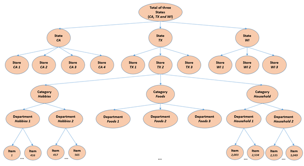
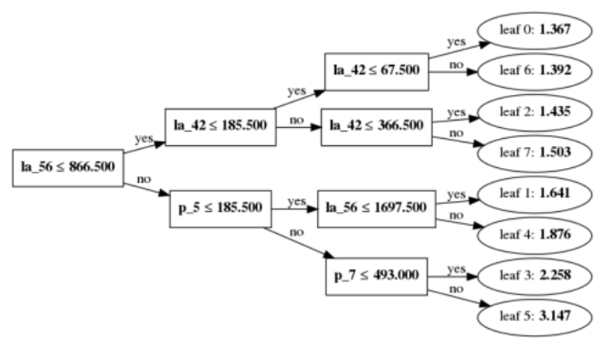

Copyright © Microsoft Corporation. All rights reserved.
  适用于[License](https://github.com/Microsoft/ai-edu/blob/master/LICENSE.md)版权许可

# 基于LightGBM的时间序列预测

表格数据是有监督学习中常见的一种数据类型。它们可以很方便地以表格的形式存储，每一行代表一个样本，每一列代表一个特征。梯度提升树（Gradient Boosted Decision Trees），简称GBDT，是表格数据学习的有力工具。LightGBM是GBDT的一个高效开源实现，目前在工业界中已经许多应用，也赢得了不少数据科学比赛。本案例将介绍如何使用LightGBM进行表格数据学习，包括数据预处理、特征工程、调参、模型训练以及解释。

# 目录

- [基于LightGBM的时间序列预测](#基于lightgbm的时间序列预测)
- [目录](#目录)
- [案例介绍](#案例介绍)
- [案例价值](#案例价值)
- [决策树和梯度提升树简介](#决策树和梯度提升树简介)
- [案例大纲与核心知识点](#案例大纲与核心知识点)
- [推荐学习时长](#推荐学习时长)
- [案例详解](#案例详解)
  - [环境与工具](#环境与工具)
    - [软件环境](#软件环境)
    - [硬件环境](#硬件环境)
- [实现流程](#实现流程)
  - [数据获取](#数据获取)
  - [数据导入](#数据导入)
  - [特征工程](#特征工程)
    - [局部特征](#局部特征)
    - [周期特征](#周期特征)
    - [特征结合](#特征结合)
    - [日历和价格特征](#日历和价格特征)
      - [日历特征](#日历特征)
      - [价格特征](#价格特征)
  - [构造训练数据](#构造训练数据)
  - [调参和训练](#调参和训练)
  - [模型解释](#模型解释)
    - [特征重要性](#特征重要性)
    - [SHAP](#shap)
  - [模型可视化](#模型可视化)
  - [LightGBM的特性使用](#lightgbm的特性使用)
    - [决策树的生长方式](#决策树的生长方式)
    - [直方图带来的加速效果](#直方图带来的加速效果)
    - [梯度单边采样（GOSS)](#梯度单边采样goss)
- [作业和挑战](#作业和挑战)
- [总结](#总结)
- [推荐阅读](#推荐阅读)


# 案例介绍
沃尔玛是有名的全球连锁超市，这样大型的超市系统运作，离不开进货成本与物流、仓储成本的控制。沃尔玛的物流效率之所以高，是因为他们运用了最先进的信息技术，建立了庞大的数据中心。这其中很重要的一项工作就是预测各种商品的销量。假设你有美国各个地区各种商品每天的销售量数据，如何运用机器学习的方法去预测接下来几十天这些销售数据？

其中还要考虑商品价格因素：同一个商品在不同商店，不同时间的价格是不一样的，价格是会调整的，这也对销售量是有影响的。除此之外还要考虑节假日和一些重要事件，比如有些天允许用SNAP消费券（SNAP是美国的一项福利，会发放食品券给低收入人群或长者），因此，在SNAP食品券开放的日子，食品类别的销量一般也会高一点。


# 案例价值
本案例通过一个时间序列预测任务，介绍使用LightGBM进行表格数据学习的整个过程，包括通过特征工程将时间预测任务转化为表格数据学习、模型调参、训练以及模型解释。一方面帮助读者掌握LightGBM的基本使用。另一方面，也帮助读者熟悉表格数据特征工程中的部分技巧。

# 决策树和梯度提升树简介

- Pandas库的基本使用

- 有监督学习的基本概念，如训练、预测、过拟合等等

- 决策树与梯度提升树  
  详细介绍见[决策树与梯度提升树](./Reference.md)

- LightGBM及其特性  

  近年来GBDT在表格数据机器学习任务中的广泛使用，很大程度上得益于XGBoost、LightGBM和CatBoost等开源的GBDT工具。这些工具在性能（准确率）和效率方面都进行了细致的优化。三个工具各有特点，其中XGBoost开源得最早，接口、功能都较为齐全。而LightGBM最注重效率方面的优化，训练速度在三者中是最快的。CatBoost则注重对类别特征的处理，以及对梯度提升过程本身进行改进。本案例重点介绍LightGBM的使用，对XGBoost和CatBoost感兴趣的读者可以在推荐阅读中找到它们的项目链接。

  这一部分简要从性能和效率两个方面介绍LightGBM的特性。在案例代码中将对这些特性进行尝试，并观察其效果。

  在性能方面，LightGBM的特点主要包括：
  1. 率先支持了按叶子分割的决策树训练方式。在更早的GBDT开源实现中，均采用按层分割的决策树训练。正如上文介绍决策树训练的部分提到的，按叶子分割的方式更加灵活。使用相同叶子数量的情况下，按叶子分割可以更加充分地拟合训练数据。
  2. 对类别特征的直接支持。在决策树的基本结构中，提到了决策树基于类别特征进行的分割，是选出类别特征所有取值中的一个子集作为判断条件。若一个样本的该类别特征值在中，则将被划分到左边的子节点，否则划分到右边的子节点。然而，要遍历所有这样的并选出最优的一个，代价十分巨大。假设一个类别特征共有种不同的取值，则需要考虑的子集的数量为。在实际的数据中，很容易出现达到上万甚至几十万的情况。因此，穷举所有的子集的代价是不可接受的。因此，在GBDT中对类别特征常见的处理方式，是将它们通过编码转换成数值特征。LightGBM提供了一种高效地寻找最优子集的方法，因此用户无需对类别特征进行额外的预处理。具体来说，在查找类别特征在某片叶子上的最优分割条件时，LightGBM首先将类别特征值按照某个统计量进行排序，然后按照这个顺序从左往右遍历不同的取值，并依次考虑将左边的全部取值作为子集。关于排序使用的统计量这里不展开介绍，但是使用这个统计量，就可以保证选取出来的一定是最优的。不过，由于选取的子集是个中最优的，因此这个方法很容易过拟合数据，尤其是在拥有每种类别特征值的训练样本数量较少的情况下。故LightGBM引入了三个对类别特征分割进行正则化的超参数，分别是:
    - **max_cat_threshold**，该参数限制子集的最大允许规模。
    - **cat_smooth**，该参数用于对排序使用的统计量进行平滑操作。
    - **cat_l2**，该参数用于增加使用类别特征时的L2正则权重。
  要让LightGBM对类别特征的直接支持达到比较好的效果，必须很仔细地调整好这三个参数，缓解过拟合。

  在效率方面，LightGBM的特性主要包括：
  1. 率先使用特征直方图来加速最优分割条件的查找。所谓的直方图优化，就是对每个特征构建一个直方图，在直方图中的每个区间中，累积了计算分割增益所需要的统计量。在查找一个特征的最优分割点，只考虑从直方图的区间边界中进行选取。通常直方图的区间数量不需要太多，几十个到两百多个就可以取得很好的结果。减少候选分割点的数量还可以起到一定的正则化作用。此外，LightGBM还采用了直方图做差的技巧。具体来说，由于直方图每个区间中累积的统计量是按数据进行累加得到的，因此一个特征在父节点中的直方图就等于在两个子节点中的直方图之和。故对属于同一个父节点的两个子节点，我们只需要对其中一个数据量较少的节点构建直方图，而另一个节点的直方图可以从父节点的直方图中减去其兄弟节点的直方图来得到。使用直方图做差可以让直方图的构建加速至少两倍。
  2. 基于梯度的单边样本采样(Gradient-based One-side Sampling，简称GOSS)。与随机森林类似，GBDT每一轮迭代可以只选取一部分数据进行训练。这样做一方面可以降低每轮迭代的训练开销，另一方面也可以提高模型的泛化性能。一般的样本采样方法是随机采样。但是在GBDT的训练中，样本的重要性是有区别的。由于每轮的决策树拟合的标签是当前每个样本的负梯度，故需要根据当前轮次的梯度进行分割增益的计算，因此梯度绝对值的大小很大程度上决定了样本对计算分割增益的贡献。因此，LightGBM提出了一种基于梯度的采样方法GOSS。假设训练数据总量为，在训练每个决策树之前，GOSS首先选出梯度绝对值最大的样本，然后从剩下的样本中，再随机选取个样本，并将随机选取的这个样本的梯度值乘上，从而保证采样后的样本梯度和是采样前的一个无偏估计（这样做是因为叶子上的分割增益的计算与梯度之和有关）。使用GOSS，可以在相同的采样率下，取得比随机采样更好的训练结果。
  3. 互斥特征捆绑(Exclusive Feature Bundling，简称EFB)。在表格数据中，常常会遇到一些特征，它们只在很少的一部分训练数据上有取值，而在大部分训练数据上都是缺失的。这样的特征称为稀疏特征。EFB将稀疏特征分组，并将每个分组合并为一个稠密特征，从而减少了训练中的实际特征数量，优化了存储空间并提高最有分割条件的查找速度。合并的原则，是尽可能地减少同组内不同稀疏特征之间的冲突（当两个稀疏特征在同一个数据点都有取值时，我们称之为一个冲突）。
  4. 基于投票的分布式训练算法。GBDT的分布式训练主要有两种模式，一种是数据分布式（data-distributed），即将训练数据按行划分到不同的机器上；另一种是特征分布式(feature-distributed)，即将数据按照特征（列）划分到不同的机器上。在数据分布式中，每台机器只能使用本地的数据构造直方图，这些直方图并不完整。因此需要所有特征的直方图进行全局的合并，再利用直方图进行最优切分点的查找。在数据分布式中，合并的通信代价与特征数量成正比。在特征分布式中，每台机器只拥有一部分的特征，因此只能构造本地特征的直方图，但这些本地特征的直方图都是完整的。因此可以利用这些直方图找出本地特征的最优分割条件，然后通过机器间的通信，比较之后获得全局最优的分割条件。但是在使用最优分割条件进行叶子节点上的数据划分时，由于仅有一台机器包含了这个最优分割条件所使用的特征值，其他机器无从知道哪些数据要被划分到左边的子结点，哪些划分到右边的子结点。因此，拥有最有分割条件特征的机器需要将数据的划分方式广播到其他所有的机器上，这一过程的通信量与数据量成正比。综上，数据分布式在特征数量多时通信开销较大，而特征分布式在数据量多时通信开销较大。LightGBM设计了一种改进的数据分布式方案，称为投票分布式(parallel voting trees)。与数据分布式一样，投票分布式将数据按行分配到不同的机器上，并使用本地数据构造不完整的直方图。但是构造完直方图之后，投票分布式只会选取一小部分特征，通过与其他机器的通信得到这些特征的全局直方图，这样就。这些特征的选取方式如下：首先每台机器使用本地不完整的直方图，计算出每个特征的最优分割增益，并选出增益最大的个特征。记这台机器给这个特征各投了一票。最后统计每个特征在所有机器中所得的票数，选出的票最高的个特征，只通信获得这个特征的全局直方图。实验表明投票分布式可以在不降低准确率的前提下减少通信时间，从而提高分布式训练的效率。

# 案例大纲与核心知识点

| 序号 |   内容  | 关键知识点 | 收获实战技能 |
|:---:|---------|------------|-------------|
| 1 |   数据导入与特征工程     |    时间序列数据的局部性与周期性   |   时间序列预测的特征工程技巧 |
| 2 |   构造训练数据     |    时间序列可构造训练数据量的计算   |  时间序列预测的训练数据构造   |
| 3 |   LightGBM的调参及训练        |  LightGBM的超参数及其特性      | LightGBM的手动调参技巧、自动调参工具NNI的使用            |
| 4 |   LightGBM的模型解释        |    SHAP值、特征重要性        |     LightGBM解释性API的使用        |


# 推荐学习时长
4~8个小时

# 案例详解

我们的案例将围绕一个时间序列预测任务展开。该任务是Kaggle上的一个比赛，M5 Forecasting - Accuarcy（https://www.kaggle.com/c/m5-forecasting-accuracy/notebooks ）。M5是一个很经典的时序序列比赛，是第五次 Makridakis Competitions （M-Competitions). M-Competitions 由预测专家 Spyros Makridakis 在1982年开始举办，意在对比各种时间序列预测方法在实际问题中的效果。 M-Competitions在时间序列预测领域有深远的影响，从中产生了各种实践中行之有效的时间序列预测方法。

M5的赛题目标是预测沃尔玛各种商品在未来28天的销量。数据里包含了美国加州、德州和威斯康星州3个州的10个沃尔玛商店的各种商品的销售数据。每个商店都给了3049个商品的销量，分属3个大类和7个小类。所以，一共有30490条时间序列。商品的分层信息如下图所示。


图源[kaggle讨论区](https://www.kaggle.com/c/m5-forecasting-accuracy/discussion/141656)

训练数据提供了从2011年1月29日至2016年5月22日，共计1941天的销量。需要预测接下来28天，也就是2016年5月23日到2016年6月19日的每天的销量。除了这些历史的销量，比赛还额外提供了下面两个信息：

- 商品价格。需要注意的是，价格是会调整的，同一个商品在不同商店，不同时间是不一样的。因此，比赛提供了每种商品在每个商店的每周价格。
- 日历信息。同时标记了节假日信息及一些比较重要的事件。此外，需要注意的是，日历里还标记了每个州是不是在当天允许用SNAP(Supply Nutrition Assistance Program, 补充营养资助计划)发放的食品券消费。SNAP是美国的一项福利，会发放食品券给低收入人群或长者。因此，在SNAP食品券开放的日子，食品类别的销量一般也会高一点。

最后需要注意的是，这次的时间序列数据具有层次化的结构，比如商品粒度，商店粒度等等。M5比赛不仅会评测最细的那个粒度（30490）的序列，还评测分层次聚合后的序列。具体来说，如下表所示，各种层次聚合后共有42840条序列。

|层次id| 聚合层次  | 序列数量  |
|----|---|---|
| 1  | 全部聚合 (1)  | 1  |
| 2  | 州 (3) | 3  |
| 3  | 商店 (10)  | 10 |
| 4  | 大类 (3) | 3  |
| 5  | 小类 (7)  | 7  |
| 6  | 大类 (3) x 州 (3)  | 9  |
| 7  | 小类 (7) x 州 (3) | 21  |
| 8  | 大类 (3) x 商店 (10)  | 30  |
| 9  | 小类 (7) x 商店 (10)  | 70  |
| 10 | 商品 (3049)  | 3049  |
| 11 | 商品 (3049) x 州（3）| 9147  |
| 12 | 商品（3049）x 商店 （10） | 30490  |
|N/A |  合计 | 42840  |

目前M5在Kaggle上公开出来的只有训练数据，即第1天到第1941天的数据。为了方便评测与说明，本案例使用前1913天的数据作为训练数据，来预测1914天到1941天的销量。并且，我们只对最细粒度的30490条序列进行预测。

## 环境与工具
本案例运行在Azure虚拟机上，操作系统为Ubuntu 18.04。但在任何安装了以下软件环境的操作系统上都可以运行。

### 软件环境
需要的软件环境如下：
Python 3.6
lightgbm 3.1.1
pandas 1.1.5
numpy 1.19.5
graphviz 0.16
matplotlib
jupyter

### 硬件环境
运行本案例需要保证至少有8G内存。

# 实现流程
以下将简略介绍实现的流程，具体流程请见[time_series.ipynb](.\src\time_series.ipynb)

## 数据获取
由于kaggle对数据集的使用规定限制了数据的分发，需要自行通过kaagle注册比赛下载数据集并放于data文件中

比赛链接：https://www.kaggle.com/c/m5-forecasting-accuracy/data

## 数据导入
data文件夹中的m5-forecasting-accuracy.zip解压后可以得到一些csv文件。

历史销量数据存储在sales_train_evaluation.csv和sales_train_validation.csv这两个文件中。

- sales_train_validation.csv包含了第1天(d_1)到1913天(d_1913)的销量信息。

- sales_train_evaluation.csv包含了第1天(d_1)到第1941天(d_1941)的销量信息，比sales_train_validation.csv多出了28天。

我们需要观察各个csv文件的数据以提取特征，

将```sales_train_validation.csv```,```calendar.csv```,```sell_prices.csv```作为训练数据读入，然后观察其特点

## 特征工程

首先，这是一个对时间序列的预测任务。在时间序列预测任务中，基于历史信息抽取的特征是很重要的一部分，这些特征又常常被称为延迟特征（Lag Feature)。延迟特征的抽取需要考虑两个主要因素。首先是**局部性**，即距离预测目标时间越近的数据影响越大，如预测t_(k+1)的时候，历史序列的值t_k到t_1的影响越来越小。其次是**周期性**，大多数实际任务中的时间序列，受到人类活动的影响，基本都会以星期（七天）作为一个周期。利用这个，我们可以聚合与预测时间点同个周期的历史值，并抽取特征。

### 局部特征

现在假设要预测的目标是第1914天的销量d_1914。先抽取局部特征。

我们可以使用历史数据中的最后7天来构造特征，得到每件商品的特征l_1到l_7。对于历史值的聚合，我们还可以用一个小技巧得到更稳定的特征。 对于单天的历史值，或多或少都有些随机因素，具有较大的不确定性，例如某天天气不好，销量突然下降。 实际上，我们可以用连续几天的加和（或均值），用于减缓不确定性带来的影响。 更具体来说，我们可以用前一天的历史值、前面两天的历史值的和、等等来作为局部特征。这里我们使用累加和作为局部特征，构造出la_1到la_7。

注意到，我们现在只用上了近期的历史数据。还有很多远期的历史数据没用上。 实际上远期的历史数据也是需要的，只不过不需要那么精细，可以做一些聚合。 例如过去两周、过去一个月的总和。

假设我们将远期的历史数据以一周为聚合单位，用上56天内的历史数据，那么就构造出了12个特征la_1, ... , la_7, la_14, la_21, la_28, la_42, la_56

```python
used_history_distances = [1, 2, 3, 4, 5, 6, 7, 14, 21, 28, 42, 56]
```

### 周期特征

现在我们来看周期特征。我们主要考虑以星期作为周期。并且，我们选用56天历史值，也就是过去8周的数据，构造周期特征。因此，我们先取得和目标预测值同周期的历史数据，得到p_1到p_8。

然后，一样的，我们也使用累计的历史值，来提高稳定性。

### 特征结合

然后我们将局部特征和周期特征合并，一共20个特征，就构成了一个时间序列的延迟特征。

另外，如同上文所提到的，这次赛题会评测所有不同粒度的时间序列。因此，在得到最细粒度（不同商店的不同商品）的特征后，我们可以按照各种层级的信息，例如大类、小类等等，聚合出各种粒度的时间序列。然后，在把这些粗粒度的序列，合并到对应的最细粒度的序列上。通过这样的处理，可以让每条最细粒度的序列，也包含聚合后的各种层级的信息。举个简单的例子，例如FOODS_3_099_CA_3这个序列，我们可以把聚合后的大类Foods的序列上抽取的特征，即聚合后的CA_3这个商店的序列特征，都算出来，然后再作为FOODS_3_099_CA_3这个序列的特征，有兴趣的读者可以尝试。

### 日历和价格特征
题目告诉我们日期和商品价格也会影响商品销量，所以也应该提取构造其相应有价值的特征。

#### 日历特征

首先，日历信息本身就是周期性的一种表达。从中我们可以挖掘出更多的周期性特征。例如，某些商品的销量可能随着月份呈现周期性规律。比如画出一种商品每月的平均销量曲线，观察其销量变化是否呈现出一定的周期性规律，如果有的话，就可以在预测销量时，参考历史数据中与预测目标日期位于同一月份的日期的销量。

此外，日历信息还包含了特殊事件。例如，当天是否在NBA总决赛期间、当天是否父亲节、所在州当天是否允许SNAP的食品消费券等等。这些特殊事件对商品的销量也会有显著影响。

故如果目标预测日期发生了某一特殊事件，则我们计算历史数据中发生相同事件的日期的销量平均值。如果目标预测日期没有特殊事件，则这些特征记为NaN。此外，我们也计算历史当中与目标预测日期使用SNAP消费券情况相同的所有日期的销量平均值。

根据以上思路，日历数据中我们可以提取6个特征
1. 同一月份
2. 事件1名称
3. 事件2名称
4. 事件1类型（体育活动 / 节日 等）
5. 事件2类型（体育活动 / 节日 等）
6. 是否可用SNAP消费卷

#### 价格特征

最后，我们尝试利用商品的历史价格信息。商品的价格一定程度上可以反应其市场供需情况，故理论上对销量的预测也有参考价值。首先绘图观察一下某个商品每周的价格与其销量的关系，这里选择的例子是FOODS_3_015_CA_1，结果是无法观察到商品价格与销量的明显关系，其他商品也是类似的关系，因此，我们暂时不考虑将价格信息加入到特征当中。读者可以思考一下如何使用价格信息构造出合理的特征。

最后，我们将所有的特征连接到一起。注意，以上我们只是计算了第1914天的数据的特征。这只些特征只能用来预测1914天的销量，也就是说，上表实际上是我们的测试数据。

为了构造训练数据，我们对1914天之前的日期进行同样的特征计算操作，并附上它们的当天销量作为数据标签。

## 构造训练数据
在时间序列的问题中，训练数据的构造一般使用滑窗的方式构造。以本案例为例，训练数据提供了长度为1913的历史序列。假设我们建模了一个单步模型，只预测下一天，那么，基于原始数据中的每一条序列，我们最多可以构造出1913条训练样本。但在这里面，时间靠前的那些样本，可以利用的历史信息就很少。因此，我们一般还要预留一个特征窗口，保证每条样本都可以抽取足够的信息。假设我们要保证每条样本至少有56天的历史信息，那么我们就需要从第57天开始滑窗。这一共可以构造出1857条样本。如果要需要预测的步长变大，比如预测后天的销量，那可以构造的样本也会变少一条。综上，对于一条时间序列，我们可以构造出  $H - f - l + 1$ 的样本，其中，H是序列的长度(本案例中为1913)，f是每条样本的最小历史信息（本案例中为56），l是预测的步长（即predict_distance）。

现在，我们已经准备好了训练数据和测试数据的特征和标签。接下来可以开始进行调参和训练了。

## 调参和训练

导入LightGBM之后，创建训练数据和测试数据。导入数据集之后，LightGBM会根据超参数，在数据集中加入一些额外的结构信息，例如，哪些特征属于类别特征、特征值离散化的边界等等。
首先可以使用一组默认的超参数训练一下，观察在测试集上的效果。

接着根据结果去调整参数，比如均方误差迭代时的转折点，可以帮助我们判断合适的迭代的次数。此外GBDT还有其他非常重要的超参数。以下是GBDT的重要超参数以及它们在LightGBM中对应的名称。
|超参数 | 作用 | 在LightGBM中的名称 |
| --- | --- | --- |
|迭代次数|即GBDT使用的决策树的数量。集成更多的决策树<br>可以提高模型的表示能力，但是也容易导致过拟合。 | num_trees |
|学习率|即每棵决策树在最终模型中的权重。过大的学习率<br>会导致模型拟合效果不佳。但是使用小的学习率<br>通常需要更多的决策树。|learning_rate|
|决策树规模|每棵决策树叶子的数量，使用更大的决策树可以提高拟合<br>能力，但是也容易导致过拟合。|num_leaves|

除了以上三个对模型表现有特别大影响的参数之外，LightGBM中还有一些重要的正则化参数。
|LightGBM超参数 | 作用 |
|---|---|
|min_data_in_leaf|限制每片叶子上最少允许的数据量|
|lambda_l2|叶子上预测值的l2正则权重|
|bagging_fraction|每棵树训练采样的训练样本比例|
|feature_fraction|每棵树训练采样的特征比例|

更多LightGBM的超参数及它们的作用可以参考
https://lightgbm.readthedocs.io/en/latest/Parameters.html
以及https://lightgbm.readthedocs.io/en/latest/Parameters-Tuning.html
。


## 模型解释

在训练得到GBDT模型之后，可以对模型进行解释分析，从而了解特征对模型预测所起的作用。这里主要介绍两种解释工具，分别是特征重要性以及SHAP值。此外，LightGBM还提供了模型可视化接口，用户可以方便地查看每个决策树的结构。

### 特征重要性
征重要性描述每个特征在GBDT模型中的整体贡献。常用的特征重要性计算方法有： 1. 计算特征在分割条件当中使用的次数。 2. 计算使用该特征所有分割的增益之和。

二者在LightGBM中都可以通过直接调用模型的feature_importance方法获得，按照第1种方法，即特征使用次数（指定importance_type为split）计算特征重要性，并将特征按照重要性排序；按照第2种方式，即特征带来的分割增益之和（指定importance_type为gain）计算特征重要性，并将特征按照重要性排序。

特征重要性的分析不仅帮助我们理解哪些因素是模型预测的重要根据，更可以帮助对特征工程进行反思，启发我们构造出更多可能有用的特征，并去掉没有帮助的特征。例如，以上结果提示我们，构造更多长期的累计销量特征有可能进一步提高模型效果。因此，特征工程——调参和训练——模型解释，这一过程实际上可以构成闭环，不断地迭代优化。

### SHAP
另一个重要的解释工具是SHAP值。它反映了每个特征对每个样本预测值的贡献。LightGBM也提供了SHAP值计算的功能，只需要在调用预测接口predict的时候指定pred_contrib=True即可。

```python
shap_values = model.predict(test_data, pred_contrib=True)
shap = pd.DataFrame(data=shap_values, columns=list(test_data.columns.values) + ["expectation"])
pd.set_option('display.max_columns', None)
```

SHAP值的具体定义比较复杂，这里进行介绍，有兴趣的读者可以参考推荐阅读材料中的决策树模型SHAP值的计算方法的相关论文。https://www.nature.com/articles/s42256-019-0138-9

## 模型可视化

使用LightGBM的plot_tree函数可以方便地画出模型中指定决策树的完整结构，包括中间节点上的决策条件和叶子节点的预测值。



## LightGBM的特性使用

以上是LightGBM使用的基本流程。上述过程默认使用了LightGBM的一些特性，包括按叶子分割的决策树训练和直方图加速优化。这一小节将回过头来考察这些特性对模型的训练究竟造成了什么样的影响。

### 决策树的生长方式

首先是按叶子分割的决策树训练。回顾在超参调优的过程中，在决策树的规模限制上，只用到了叶子的数量$num\_leaves$。这是因为LightGBM默认决策树都是按叶子分割进行训练的。当然，LightGBM也提供了对决策树最大深度的限制，由超参数$max\_depth$控制。如果设置$num\_leaves$的值为$2^{max\_depth}$，则决策树等价于按层分割的训练，得到的是一个深度为$max\_depth$的完全二叉树。在本案例中，训练样本量较多，因此使用较为灵活的按叶子分割应该得到更好的结果。我们对这一猜测进行验证。

### 直方图带来的加速效果

LightGBM使用直方图优化进行训练，超参数$max\_bin$指定了直方图的区间数量。前面的流程中始终将这个超参数保留为默认值$max\_bin=255$。这里我们调整$max\_bin$，依次尝试$[16, 64, 256, 512, 1024, 2048, 4096, 9192, 18384, 36768, 75536, 151072]$并观察$max\_bin$对训练速度和准确率会造成什么样的影响。

### 梯度单边采样（GOSS)

以上过程使用的采样策略为默认的随机等概率采样，即每个决策树随机等概率采样$bagging\_fraction$指定的样本比例。在背景介绍中，我们提到了LightGBM实现了一种更高效的采样方法GOSS，它基于梯度对样本进行采样，从而减少采样带来的准确率损失。GOSS的采样率由两个超参数决定，其中$top\_rate$指定了梯度最大的被保留的样本比例（对应背景介绍部分的$a$），$other\_rate$指定了剩余样本中随机等概率采样的比例（对应背景介绍部分的$b$）。为了比较GOSS和随机等概率采样的效果，将自动搜参得到的最优参数中的$bagging\_fraction$替换为两个$top\_rate$和$other\_rate$的值，并使得$top\_rate+other\_rate=bagging\_fraction$，并设置$boosting\_type$为$goss$（默认的$boosting\_type$为$gbdt$）。

# 作业和挑战
1. 案例中只展示了如何使用前1913天数据预测第1914天的销量。尝试完成对1915天的销量预测。
2. 对于单天的预测值我们可以使用均方误差来评价其准确程度，但是如果我们想评价从1914天到1941天这28天整体预测的准确程度，均方误差就不一定公平。因为每一天的销量数值差别可能很大。例如，一个产品在1914天的销量为5，但是在1916天的销量为100。如果我们对1914天的销量预测为4，1916天预测为90，其实已经比较准确了。但是这两天的误差平方和已经达到了101，这是一个很大的数值。因此，均方误差不能很好地衡量预测的时序结果的准确性。为了给一个更加公平的标准，M5的比赛提供了一个特殊的评价指标RMSSE(Root Mean Squared Scaled Error)，其计算方法如下

&space;0)" title="\text{RMSSE } = \sqrt{\frac{1}{h} \frac{\sum_{t=n+1}^{n+h} (y_t - \hat{y}_t)^2}{\frac{1}{n-i} \sum_{t=j}^{n-1} (y_{t+1} - y_{t})^2}}, \text{where } j=\min_{j}(y_j > 0)" />

其中，为预测的长度，也就是28，为历史的长度，为天的真实值，为天的预测值。另外需要注意的是，上面式子的分母里面那个求和的起点是第一个销量大于0的时间点。M5使用RMSSE主要是由于数据中有很多零值，使用传统的指标，容易在预测值很小的时候取得较好的结果。用RMSSE可以有些避免这个问题。同时，RMSSE对序列的量纲不敏感，可以用在具有不同量纲的各种序列上。

然后，对于不同的序列，使用使用加权平均的方式，称为WRMSSE (Weighted RMSSE)。


其中，为每条序列的权重，由训练数据里的最后28天计算得到。计算方法为该序列的最近已知的28天内的销售金额（销量乘价格）占全部销售金额的比例。


其中，为历史的长度，为第个序列在第天的销售额，为总的销售额。

请在1的基础上，计算出你的预测结果的RMSSE值。

3. 在案例中的模型解释性分析部分，我们查看了每个特征的重要性。这对你有什么启发，请根据这些特征重要性构造一些新的特征，并去掉一些不重要的特征。观察这些操作是否能够提升模型的效果。
4. 从案例展示的特征工程，我们会发现特征工程往往需要读者对问题有一定的背景知识。这就使得特征工程变成一项十分依赖经验，且不能够在不同问题之间迁移的工作，因此十分耗费人力。随着AutoML的概念越来越被重视，人们也希望能够通过自动化的方法来进行特征工程。在2019的KDD Cup，第四范式举办了一个AutoML的比赛，它提供给参赛者10个不同的表格数据任务。参赛者需要根据前5个任务，设计出一套通用的，从特征工程、调参，到输出模型预测的全套完整自动化机器学习方案。在测试阶段，参赛者的方案将无人为干预地、自动地运行在后5个表格数据任务上，并以这5个任务的评测结果来评估参赛者提供的方案。比赛的具体信息参见链接
https://www.4paradigm.com/competition/kddcup2019
。
请你思考，如何设计一套这样的自动化机器学习方案。比赛前10名的源代码在以上链接中均有提供，可供读者参考。

# 总结
我们首先简要介绍了表格数据、决策树和GBDT的基本知识。随后，通过M5商品销量时间序列预测任务，展示了使用LightGBM进行表格数据学习的流程。在特征工程部分，我们借助pandas库来实现了多部份不同的特征。通过历史销量信息，构建了累计销量特征和7天周期特征。通过日历信息，构建了同月份平均销量特征和特殊事件特征。随后，我们分别介绍了LightGBM的手动调参和使用nni进行的自动调参。最后，我们对模型进行解释性分析。

本案例仅仅是初步的介绍。如果读者希望学习更多在实际任务中使用LightGBM或其他GBDT工具的技巧，可以参考Kaggle等平台上的机器学习比赛的优胜解决方案。有兴趣的读者也可以参加这些比赛，获得更多的实战经验。

# 推荐阅读
1. 论文：Loh W Y. Fifty years of classification and regression trees[J]. International Statistical Review, 2014, 82(3): 329-348.
  链接：http://pages.stat.wisc.edu/~loh/treeprogs/guide/LohISI14.pdf
2. 书：Friedman J, Hastie T, Tibshirani R. The elements of statistical learning[M]. New York: Springer series in statistics, 2001.
3. XGBoost文档：https://xgboost.readthedocs.io/en/latest/
4. XGBoost论文：Chen T, Guestrin C. Xgboost: A scalable tree boosting system[C]//Proceedings of the 22nd acm sigkdd international conference on knowledge discovery and data mining. 2016: 785-794.
  链接：https://arxiv.org/pdf/1603.02754.pdf
5. LightGBM文档：https://lightgbm.readthedocs.io/en/latest/
6. CatBoost文档：https://catboost.ai/docs/concepts/about.html
7. SHAP值相关论文：Lundberg S M, Erion G, Chen H, et al. From local explanations to global understanding with explainable AI for trees[J]. Nature machine intelligence, 2020, 2(1): 56-67.
  链接：https://www.nature.com/articles/s42256-019-0138-9
8. XGBoost的github链接：https://github.com/dmlc/xgboost
9. CatBoost的github链接：https://github.com/catboost/catboost
