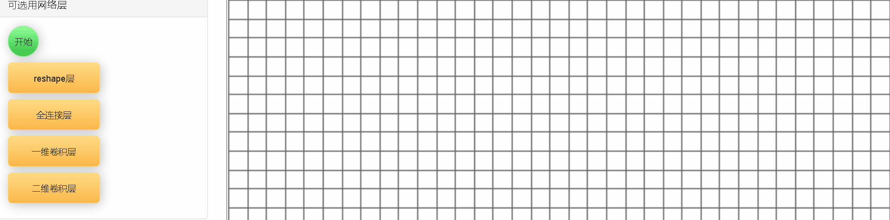
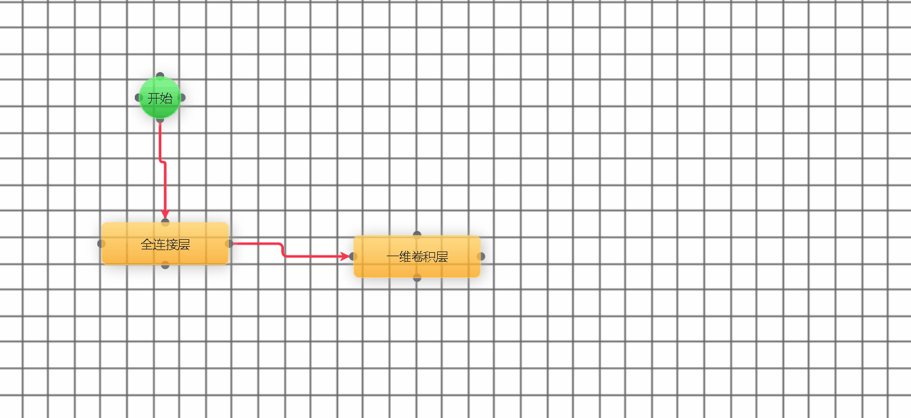
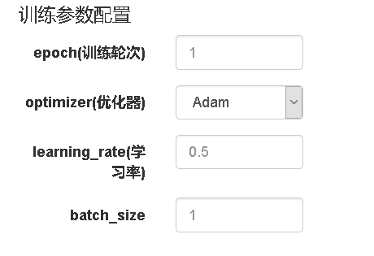
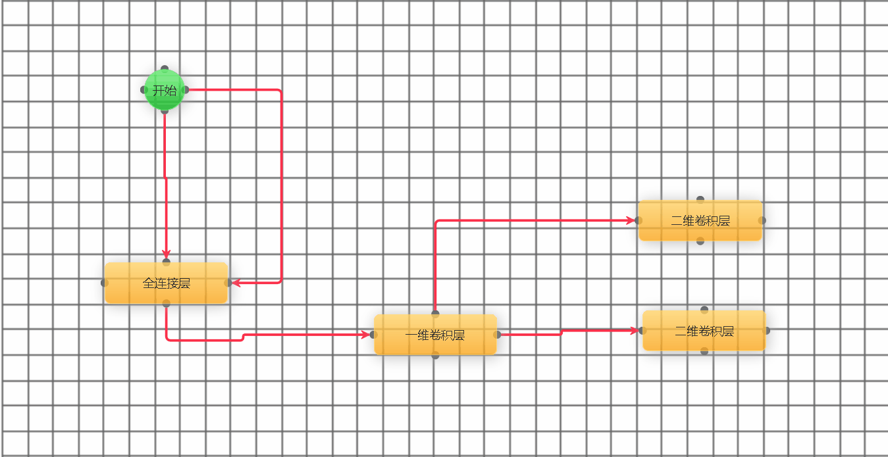
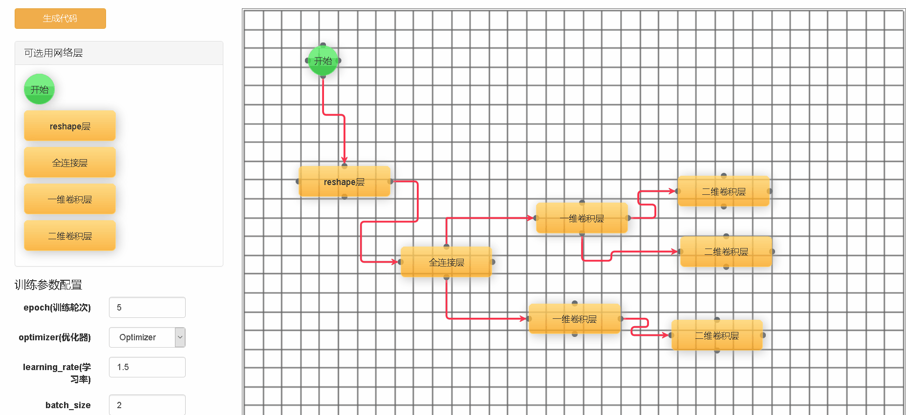

# 北航19软件工程VisualPytorch网站

## 项目介绍

该项目为一个通过拖拽组件来生成Pytorch代码的网站。

如今deep learning大火，很多计算机人甚至其他专业的人都会向deep learning中跳，但从0到入门这一过程中着实面临着一些困难：

- 除了看教材以外，没有好的入门方法
- 教材中的概念比较抽象，不易弄懂
- 教材中的例子都是以代码形式的，并不直观

可见现有的学习途径对初学者并不是很友好。所以我们搭建了一个在线平台， 提供给用户可拖拽的编程方法，通过图形连接自动生成程序。用这种方式可以帮助没有接触过神经网络的人更快、更直观地理解基本原理，并做一些前期的简单练习，能够快速入门。

项目github链接：<https://github.com/16061027/VisualPytorch>

项目发布网址：<http://114.115.151.39/>

## 项目展示

目前我们只发布了alpha使用版本，网站仅仅提供了核心功能。

#### 1、拖拽层进入画布以及层之间的连线

#### 2、设置画布中网络层的参数

#### 3、设置训练参数

#### 4、 删除画布中的层和连线

#### 5、生成代码

## 关于我们

**项目开发团队**：2019北航软件工程葫芦娃团队

**团队博客**：<https://www.cnblogs.com/1606-huluwa/>

**使用中发现问题请发邮件到**：464365439@qq.com

