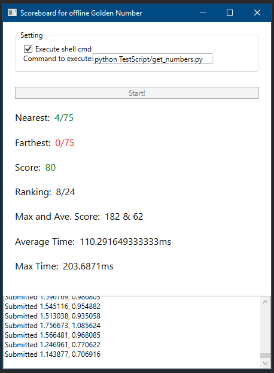

# 单机版黄金点游戏
这是单机版的黄金点游戏，使用者可以提供一段机器人程序。该程序应通过历史记录计算出新一回合要提交的数，并在400轮游戏中尽可能得更高的分数。

解决方案中提供两个程序：
* 目录 [./Bot](./Bot/) 是单机版机器人程序，这是一个模板，我们可以在其中用 C# 编写机器人逻辑，生成一个控制台程序。生成的程序可以在黄金点机器人比赛环境中进行比赛。除此之外，该程序还被 [./OfflineScoreboard](./OfflineScoreboard) 中的图形界面直接引用。
* 目录 [./OfflineScoreboard](./OfflineScoreboard) 是一个帮助我们查看机器人程序性能的图形界面。通过该界面，我们可以在本地了解、体验黄金点游戏，并使用一份给定的模拟数据来测试、验证自己的机器人程序，以及在查看该机器人程序的得分及性能。

用于查看机器人性能的图形界面运行效果如下图：



# 什么是“黄金点”游戏？
请在邹欣老师的博客查看游戏介绍：[创新的时机 – 黄金点游戏](https://blog.csdn.net/SoftwareTeacher/article/details/25794525)

# 单机版的测试模拟程序游戏规则
**单机版的游戏规则与邹欣老师博客中介绍的游戏规则略有不同。**

**并且该模拟程序是通过对历史数据进行复盘来进行游戏的，并无任何对手（如机器人程序）与游戏者一同进行实时计算。**

- 历史数据中，每回合有 `2M` 个数（设其为 `N_{1,1}, N_{1,2}, ..., N_{M,1}, N_{M,2}`），这些数字是过去某次游戏中的 `M` 个玩家提交的（设这些玩家为 `P_1, P_2, ..., P_M`，即 `P_i` 玩家提交 `N_{i,1}, N_{i,2}` 两个数）。
- 每一回合中，当前单机版的玩家需提交两个有理数，范围在 `(0, 100)` 开区间之间。
- 所有提交全部合法的玩家（包括历史记录中的玩家和当前的真实玩家），他们这一回合提交的数会被用于计算 **黄金点**。这些玩家组成集合 `K`，集合中除了当前玩家还有 `C` 人。
- 这一回合的 **黄金点** `G`，等于，集合 `K` 中玩家提交的所有数的均值乘以 0.618。
- 根据每个玩家提交的数相对黄金点的差值绝对值，该回合得分依照：
    - 差值绝对值最小的玩家得 `C` 分；
    - 差值绝对值最大的玩家扣 `2` 分；
    - 可能一个数得分，另一个数扣分。两个数相同时，不重复得分或扣分；
    - 其余玩家得 `0` 分。
- 只在计算每回合的得分时，会将当前玩家的提交纳入统计。与之相对的，当前玩家的提交不纳入历史数据。
- 所有回合结束后，累计得分最高者胜。

# 机器人接口规格

## 输入的数据格式
- 输入的数据是多行的字符串。如无特殊说明，每行之间是由 `\n` 分隔的。
- 第一行是由 `'\t'` 分隔的两个整数。第一个整数 `T` 为接下来还有多少行数据，第二个整数 `S` 为每行数据的列数；
- 接下来的 `T` 行数据，每行都是：
    - 由 `'\t'` 分隔的 `S` 个数（可用 C# 的 `double` 类型表示）；
    - 第一个数是历史中，这一轮的黄金点。其产生过程不考虑当前玩家的影响；
    - 之后的 `S - 1` 个数，是历史中被这一回合提交的数（对应规则里的 `2M`）。当前玩家曾提交过的数不包含在内。
    - 这 `S - 1` 个数，每两个数，都是按照过去参与的 `M` 个玩家的顺序排布的，这个顺序是固定的。每个玩家提交的两个数，没有顺序。
- 某个历史数据可能为 `0`，表示当时出现了非法的数。

每到新的一回合，输入数据中的 `T` 会较之前加 1。需要注意的是，输入数据全部都是历史数据，不受当前单机版游戏的提交影响。

一个输入的例子为：
```
2	5
18.07   30  30  17  40
24.87   18.08   18.08   99.9    25
```

## 直接提供计算函数

应提供的核心计算代码在 `./Bot/NumberHelper.cs` 中。对于这种方法提供的计算函数，必须使用 C# 语言编写。

在 `NumberHelper.cs` 代码文件中，有一 `NumberHelper` 类的静态方法 `GetNumber`，这个方法就是需要使用者实现的机器人程序。

该方法被声明为：
```cs
static Tuple<double, double> GetNumber(string input)
```

> 可以通过打开 `./Player.sln` 解决方案文件，以便在 Visual Studio 中直接编辑源代码。

### 返回值的格式
- 一个 `Tuple<double, double>` 对象。包括当前参与者，根据之前的历史数据计算出的、为当前回合提交的两个数。
- 不能为 `null`，且其中的数都应满足规则的要求。

> 可以通过 `Tuple.Create(1.0, 2.0)` 或构造方法创建返回值。

## 调用命令行进行计算
该客户端还支持调用命令行来进行数字的计算。该功能可以在启动 [./OfflineScoreboard](./OfflineScoreboard) 中的图形界面后，通过勾选`Execute shell cmd`选框来启动。在显示出的输入框里输入要执行的命令行命令，该客户端会通过执行该命令行命令的方式进行计算。

作为数据交互的输入输出，是通过标准输入输出管线（stdin、stdout）完成的。

与该客户端一起分发的，有我们准备的示例脚本。可以通过在界面上填写如下命令执行它（必须先安装Python 3.5以上版本）：
```cmd
python TestScript/get_numbers.py
```

### 返回值格式
由 `\t` 分隔的两个合法数字组成的字符串，必须通过标准输出（stdout）传输的。

此外，可以通过标准错误输出（stderr）输出调试信息，这些信息会在客户端界面被显示。


---
因为是通过历史数据复盘，所以玩家提交的数，只会被用于计算当前一轮的黄金点，但是不会在下一轮时作为历史数据出现。并且，每一轮游戏中时看到的历史黄金点，都是纯粹的历史数据，其计算不涉及玩家之前提交的数。这和比赛环境中的游戏是有所不同的。

# 如何让这个项目在机器上跑起来呢？
为此，我们需要：
- Windows 操作系统；
- Visual Studio 2017（推荐[可免费用于教室学习环境的 Community 版本](https://visualstudio.microsoft.com/zh-hans/vs/community/)[1]），并安装 ***.NET桌面开发*** 工作负载。

[1] 相关的使用条款，请参见 <https://visualstudio.microsoft.com/zh-hans/license-terms/mlt553321/>。
