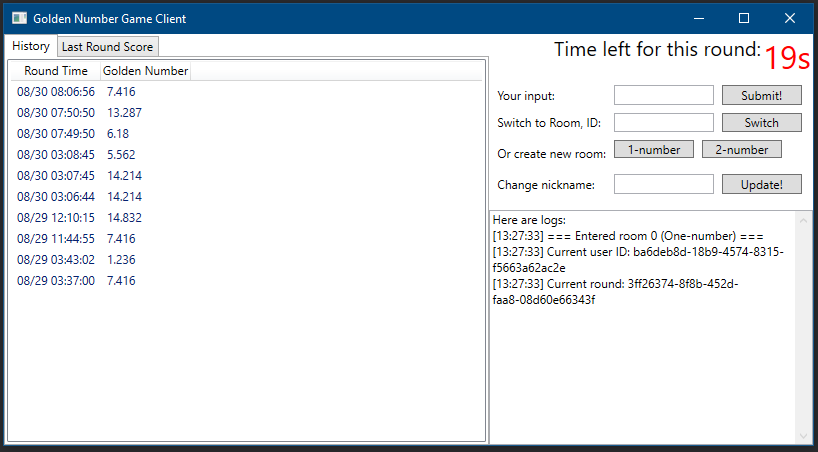

# 这是什么项目？
这是一个可以与“黄金点”游戏服务器交互的示例客户端程序，使用 C# + [WPF](https://docs.microsoft.com/en-us/dotnet/framework/wpf/) 实现。
这个客户端提供了基本的游戏功能，比如控制游戏的进程、提交黄金点、查看历史提交数据、游戏房间管理等。

效果如下图：

# 我们需要哪些预备知识来阅读这些代码？
为了阅读这部分代码，我们需要：
- 对 C# 编程语言有基本的了解；
- 对 C# 的 `async/await` 编程模式有基本的了解。

同时，这些知识能更好地帮助理解这些代码：
- 对多线程操作的基本认识；
- 对 `Task`-based 异步操作的理解。
- 对 WPF 和 XAML 的了解。

# 如何让这个项目在机器上跑起来呢？
为此，我们需要：
- Windows 操作系统；
- Visual Studio 2017（推荐[可免费用于教室学习环境的 Community 版本](https://visualstudio.microsoft.com/zh-hans/vs/community/)[1]），并安装 ***.NET桌面开发*** 工作负载。

[1]: 相关的使用条款，请参见 <https://visualstudio.microsoft.com/zh-hans/license-terms/mlt553321/>。
